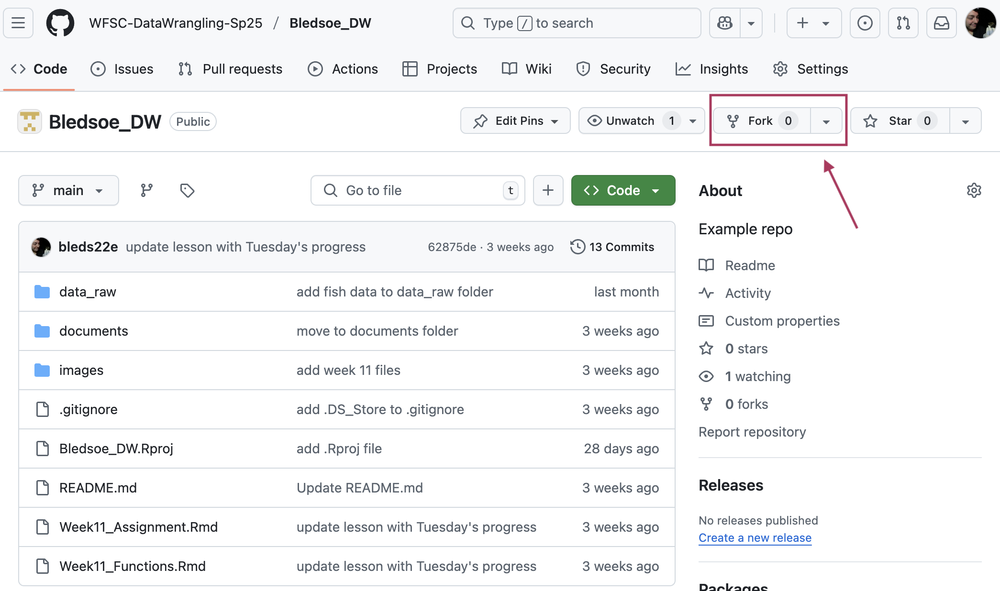
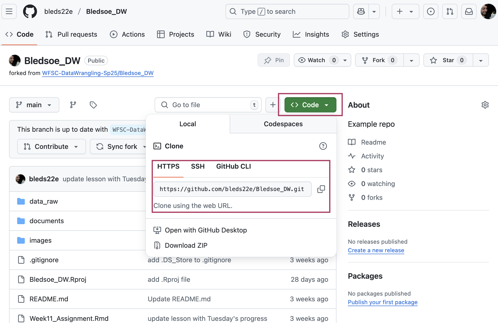
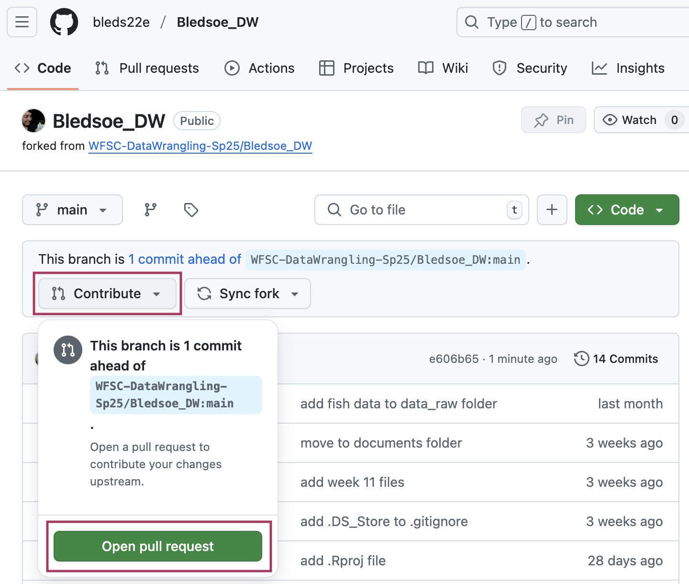

```{r setup, include=FALSE}
knitr::opts_chunk$set(echo = TRUE)
```

# Assignment Overview

For this assignment, you will conduct a formal **peer code review** of another student’s final project hosted on GitHub. You will assess code for clarity, functionality, organization, and reproducibility, and provide **constructive, actionable feedback**.

The majority of your code review will occur on GitHub (follow the instructions below). In addition, you will submit a knitted PDF file with a completed checklist and reflection to D2L.

**Total Points**: 100

**Due Date**: Sunday, May 11 at midnight MST

------------------------------------------------------------------------

# Assignment Instructions

## 1. Access Your Assigned Peer’s GitHub Repository *(5 points)*

-   Go to your peer's GitHub repository.
-   Fork and clone the repository to your computer (see detailed instructions below).
-   Review the README and folder structure before diving into code.

## 2. Review Code and Comment on GitHub *(75 points total)*

Leave **specific, respectful, and helpful** comments directly on GitHub. See the "Checklist" document for more detailed information.

-   Leave at least **8 inline comments, suggestions, or edits** across the project.
-   Be specific. For example, *"Consider renaming this function to clarify its purpose"* is more helpful than "*This is confusing."*

## 3. Submit the Checklist and Reflection to D2L *(20 points)*

In the `PeerCodeReview_Checklist_Reflection.Rmd` file, complete the checklist and write 7-10 sentences summarizing your review experience:

-   What was done well?
-   What was challenging about this assignment?
-   What did you learn for your own projects?
-   How did you approach constructive feedback?

Upload the knitted `.pdf` file to the "Peer Code Review" Assignment on D2L.

------------------------------------------------------------------------

# Grading Rubric

| **Category** | **Points** | **Criteria** |
|----|----|----|
| *Repository Access & Setup* | 5 | Repository is successfully forked and cloned. Reviewer created a new branch. |
| *Clarity & Readability Comments* | 15 | Comments address variable names, structure, and ease of understanding. |
| *Functionality Comments* | 15 | Reviewer tested code and provided feedback on functionality and outputs. |
| *Code Organization Comments* | 15 | Feedback includes directory structure and logic of .Rmd layout. |
| *Documentation Comments* | 15 | Reviewer comments on README quality and .Rmd documentation. |
| *Suggestions for Improvement* | 15 | At least 3 specific, actionable, and constructive suggestions are given. |
| *Checklist and Reflection* | 20 | Checklist completed and a thoughtful, specific, and complete reflection (7-10 sentences). |
| **Total** | **100** |  |

------------------------------------------------------------------------

## Step-by-Step Instructions for GitHub Peer Code Review

Follow these steps to complete your peer code review using GitHub. This process uses a **fork-based workflow**. You will fork your peer’s repository, add review comments in your fork, and submit a draft pull request with your feedback.

### Step 1: Fork and Clone the Repository

-   Go to your assigned peer’s GitHub repository via the provided link. You should have access (if not, email me!)
-   Click the **Fork** button in the top-right corner to create your own copy of their repository under your GitHub account.

{width="75%" fig-align="center"}

-   Make sure you create the "forked" repo in your own personal account, not in the class organization!

{width="75%" fig-align="center"}

-   Once you have successfully forked the repo, you should have a copy of your peer's repo in your personal GitHub account.

{width="75%" fig-align="center"}

-   On your forked copy, click the green **Code** button and copy the URL.

{width="75%" fig-align="center"}

-   You can now proceed to create an RStudio Project linked to your forked version of the repository as you would with any Github repository
-   In RStudio: Go to *File \> New Project \> Version Control \> Git*, paste the URL, and choose a folder.

{width="49%"}

{width="49%"}

-   You should now have your own local copy of your fork of your peer's final project repo.

{width="75%" fig-align="center"}

### Step 2: Add Comments to the Code

You should leave at least **eight comments** during your review.

1.  Open the cloned project.
2.  Leave review notes using comments (for example, lines that begin with “REVIEW:”).
3.  Save the files after adding your comments.

{width="75%" fig-align="center"}

{width="75%" fig-align="center"}

### Step 3: Commit and Push Your Changes

-   Save the comments or edits to the files.
-   Commit and push your comments and edits
    -   Use the Git pane to stage and commit the changes.
    -   Write a brief commit message like “Peer review comments.”
    -   Push the changes to your forked GitHub repository.
-   Repeat this process as many times as needed.

{width="75%" fig-align="center"}

### Step 4: Create a Pull Request to Submit Your Review

Once you have completed your comments:

-   Go to your **forked repository** on GitHub and click on the "Contribute" button.

{width="75%" fig-align="center"}

-   Select "Open pull request."

{width="75%" fig-align="center"}

-   Confirm that:
    -   The *base* repository is your peer’s/the class organization's (e.g., `WFSC-DataWrangling-Sp25/project`).
    -   The *head* repository is your fork (e.g., `yourusername/project`).
-   Write a short summary of your review in the pull request description.
-   Click on the downward arrow on the right side of the **"Create pull request"** button and select "Create draft pull request."

{width="75%" fig-align="center"}

**Important Note!** You are submitting comments and suggestions only. Do NOT merge the pull request.

If you and/or you peer want to have further discussion about any of the comments or suggestions, you can use the "Conservation" and "Files Changed" tabs.

{width="49%"} {width="49%"}
