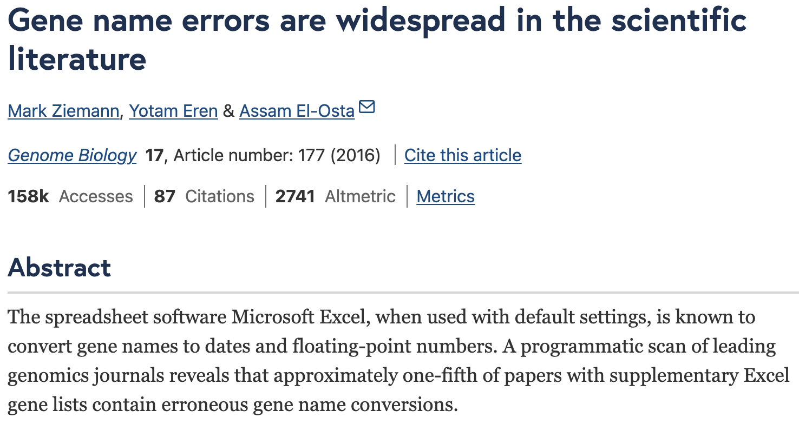
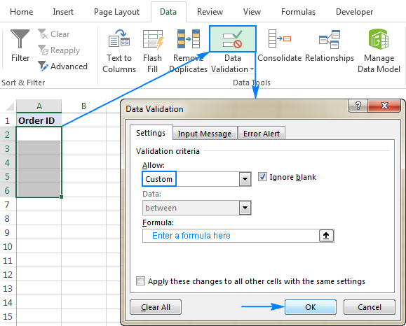

## Data Entry: Planning

Your first step in data entry should be to plan a data structure that follows the tidy data rules.

## Where to Enter Data

We have options for where we can enter our data:

::::: columns
::: {.column width="50%"}
- Spreadsheets
- Text file (e.g., csv)
- Database (e.g., Microsoft Access\*, SQL)
- Forms (e.g., Google Forms)
:::

::: {.column width="50%"}
:::: {.columns}
::: {.column width="50%"}

:::
::: {.column width="50%"}

:::
::::
:::
:::::

\* Microsoft Access is proprietary and is not considered reproducible because other programs cannot open Access databases.

## A warning about spreadsheets...

Beware of data conversion issues!

::::: columns
::: {.column width="50%"}

:::
::: {.column width="50%"}

:::
:::::

## Quality Assurance (QA)

Our goal is to **prevent** incorrect data from being entered at all!

In spreadsheets, we can create rules about what values can be entered into a column.

## QA: Double Entry

Another way to protect incorrect data from being entered is to **double enter** the data.

- Have 2 different people enter the data into the spreadsheet
- 1 person entering twice will work in a pinch, but 2 different people is preferred
- This is one time that multiple sheets in a workbook might be a good idea

## Quality Control (QC)

Finding incorrect data that has **already been entered**.

- This can be done in spreadsheets or in code
- Using code is preferable (reproducible!)
- If using a spreadsheet, always save an original copy before making any changes!

Sorting data (looking for odd or unrealistic values) and plotting are good ways to QC.
