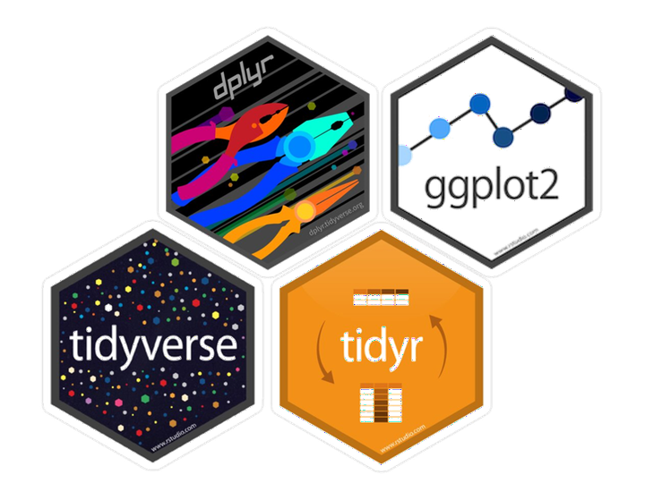
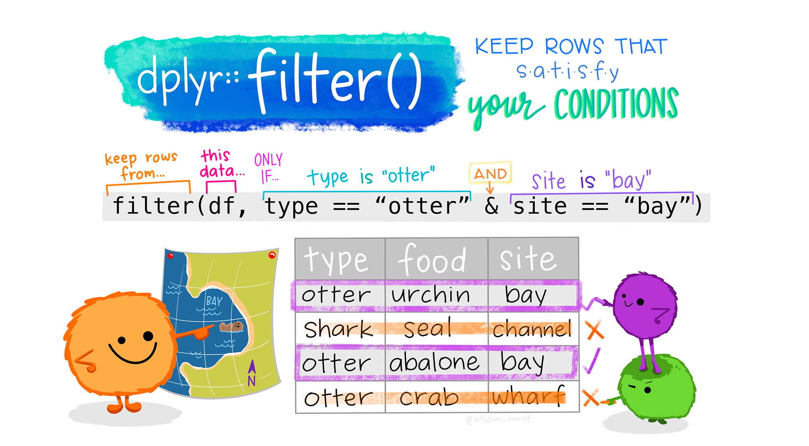

```{r setup, include=FALSE}
knitr::opts_chunk$set(echo = TRUE, fig.align="center", out.width = "50%")
```

# 2-dimensional Data and the `tidyverse`

## The `tidyverse`: What is it?

Different programming languages have different syntax (language structure). The `tidyverse` is a package (more accurately, a set of packages) offered in R that all have similar goals and a unified syntax designed to work particularly well with 2-dimensional data (data with rows and column). We call these 2-dimension data structures "data frames" in R.

Until now, all of the coding we have done is in the original R language, which is often called "base R." The syntax in the `tidyverse` is often pretty different from base R. Both are useful, and many people often combine them, which is why we start with base R.

### Wait, what is a package??

Packages are one of the neatest things about working in an open-source environment like R! They contains bits of code (often in the form of functions) that can be reused, making them a core component of reproducible data science. Anyone can develop a package, and there are thousands of them doing all sorts of things.

```{r, echo=FALSE}

```

### Explore the `tidyverse`

If you want to learn more about the tidyverse, head over to [www.tidyverse.org](www.tidyverse.org) and browse the site. Below is a brief summary of *some* of the packages I think you might find the most useful.

-   `tidyr`: creating data that is consistent in form/shape
-   `dplyr`: creating data that is clean, easily wrangled, and summarized
-   `ggplot2`: publication-worthy plots using The Grammar of Graphics
-   `tibble`: data frames but better!
-   `readr`: fast and friendly ways to read data into R
-   `stringr`: easy manipulation of strings (character data)
-   `lubridate`: easy manipulation of time and date values

## Using `dplyr` and `readr`

### Download and install

In most scenarios, you will need to download a package from the internet onto your computer before you can use it in RStudio. However, with Posit Cloud, I've already done this step for you!

For future reference, though:

-   when using RStudio on your own computer (not on Posit Cloud), you usually only need to go through this process once until you update R
-   we use the function `install.packages()` to download the package

```{r install_tidyverse, message = FALSE}
# download and install dplyr and readr
# to run the line of code, remove the # in front of the line below and run this chunk
# install.packages("dplyr")
# install.packages("readr")
```

### Load into R

Any time we open R/RStudio and want to use functions from a package, we need to "load" the package. We use the `library()` function to do this.

```{r load_packages, message = FALSE}
# load the tidyverse (tell RStudio we want to use this package in this session)
library(readr)
library(dplyr)
```

## Set-Up

We are going to download to files into Posit Cloud for us to work with this week. Go ahead and run this code chunk. You should see new CSV files show up in the Files tab.

```{r}
# for the lesson
download.file("https://ndownloader.figshare.com/files/2292172", "surveys.csv")
download.file("https://ndownloader.figshare.com/files/3299474", "plots.csv")
download.file("https://ndownloader.figshare.com/files/3299483", "species.csv")

# for the assignment
download.file("http://www.datacarpentry.org/semester-biology/data/shrub-volume-data.csv", "shrub-volume-data.csv")
```

We've already talked about some of the benefits of CSV file. They work very nicely in R.

Click on `species.csv` and select View File. If we look at one of these files, we can see that it is plain text, so any program can read it. This makes it *interoperable*, which is an important tenant of reproducibility.

The first row is the header row, with different column headers separated by commas. All of the other rows are the data, again with different columns separated by commas. Hence the name “comma separated values."

## Loading and Viewing the Data

We load these into R using a function from the `readr` package called `read_csv()`.

```{r}
surveys <- read_csv("surveys.csv")
species <- read_csv("species.csv")
plots <- read_csv("plots.csv")
```

The `tidyverse` (in this case, the `read_csv()` function) converts 2D data into something called a tibble! For our intents and purposes, it is basically the same as a data frame (and I'll probably call it a data frame, in reality).

We have three tables here:

-   `surveys`: main table, one row for each rodent captured, date on date, location, species ID, sex, and size
-   `species`: Latin species names for each species ID and general taxonic information
-   `plots`: information on the experimental manipulations at the site

A few things to note about these tables:

-   Good tabular data structure; one table per type of data
-   Tables can be linked together to combine information.
-   Each row contains a single record (single observation or data point)
-   Each column or field contains a single attribute or type of information

We can explore the data frames in the Environment tab or through some functions.

```{r}
str(species)
names(species)
head(species)
glimpse(species) # from dplyr
```

## Subsetting in base R

Before we jump into using the `tidyverse`, let's briefly explore how we would subset 2D data using base R. As you might recall, we use `[]` in base R to specify that we want a smaller part of the data.

With data frames, we need to specify 2-dimensions of the data (row and column).

```{r}
# the order is [row, column]
species[2, 1]
```

If you want to retain *all* rows or *all* columns, you can leave that space blank.

```{r}
# return first 6 rows and all columns
species[1:6, ]

# return all values in the first column
species[ , 1]
```

There is a special way to pull out a single column from a data frame and have it be treated as a vector (1-dimensional data). We use a special operator, `$`.

```{r}
species$species_id
```

## Intro to `dplyr`

`dplyr` (pronounced D-ply-R) is a modern data manipulation library for R that uses the syntax of the `tidyverse`. It tends to be a bit more intuitive than using base R, especially ask tasks become more complicated.

## `select()`ing columns

Let's use our first function, `select()`. Select allows us to pick out specific columns from our data. You can use names or their position in the data frame.

The first argument in the function is the data frame. Any following arguments are the columns we want to select.

```{r}
# select one column
select(surveys, year)

# select multiple columns (in any order)
select(surveys, year, month, day)
select(surveys, month, day, year)

# select a consecutive columns
select(surveys, month:year)

# remove columns
select(surveys, -weight)
```

It is important to remember that the computer interprets everything literally. We need to tell the function the **exact** names of the columns.

### Let's Practice!

Get started with your Assignment. After the set-up, work on Question 1a-b.

## Creating new columns with `mutate()`

```{r, echo=FALSE}
knitr::include_graphics("images/mutate.png")
```

Sometimes our data doesn't have our data in exactly the format we want. For example, we might want our hindfoot data in cm instead of mm.

The `dplyr` function called `mutate()` lets us create a new column.

The first part of the argument in the mutate function (before the `=`) is the name of the new column we want to create (or, sometimes, the name of a column we want to overwrite). After the `=` is what we want the new column to contain.

```{r}
mutate(surveys, hindfoot_length_cm = hindfoot_length / 10)
```

If we look at the `surveys` object, will it contain the new column?

To store the results of these functions for later, use we need to assign them to a new object or overwrite the existing object.

```{r}
surveys_cm <- mutate(surveys, hindfoot_length_cm = hindfoot_length / 10)
```

## Sorting data with `arrange()`

We can sort the data in the table using the `arrange()` function. Let's sort the surveys table by weight.

```{r}
arrange(surveys, weight)
```

We can see that the rows are now in order from the smallest weight to the largest.

We can reverse the order of the sort by “wrapping” weight in another function: `desc()` for “descending"

```{r}
arrange(surveys, desc(weight))
```

We can also sort by multiple columns. Perhaps we want to sort first by `plot_id` and then by the date.

```{r}
arrange(surveys, plot_id, year, month, day)
```

### Let's Practice

Work on Question 1c-d.

## `filter()`ing rows

```{r, echo = FALSE}

```

The `filter()` function allows you filter rows by certain conditions.

We start with the data frame, then we set a condition that has to be met. Let's say we want only rows for the species ID "DS."

To set a condition, we start with the name of the column the want to filter based upon, species_id. We then use `==` to set the condition.

Our condition is that we want rows with the value "DS" in the species_id column. "DS" here is a string (character data), not a variable or a column name, so we enclose it in quotation marks.

```{r}
# base R
# surveys[surveys$species_id == "DS", ]

# dplyr
filter(surveys, species_id == "DS")
```

Like with vectors, we can have a condition that is “not equal to” using “!=” Perhaps we want the data for all species except “DS."

```{r}
filter(surveys, species_id != "DS")
```

We can also filter on multiple conditions at once.

In computing, we combine conditions in two ways: “and” & “or”

Using “and” means that all of the conditions must be true. Do this in `dplyr`, we can add arguments separated by commas or use the `&` symbol.

To get the data on species “DS” for the year 1995:

```{r}
# same thing
filter(surveys, species_id == "DS", year > 1995)
filter(surveys, species_id == "DS" & year > 1995)
```

This approach is mostly useful for building more complex conditions.

When we want rows for which one or more of the conditions are met, we use “or”, which is the `|` symbol.

```{r}
# compare to the code above
filter(surveys, species_id == "DS" | year > 1995)

# if we want multiple options from the same column, need to use "or"
filter(surveys, species_id == "DS" | species_id == "DM" | species_id == "DO")

```

### Let's Practice

Work on Question 1e-g.

## `filter()`ing null values

One of the common tasks we use `filter` for is removing null values from data. Based on what we learned before, it’s natural to think that we do this by using the condition `weight != NA`.

```{r eval=FALSE}
filter(surveys, weight != NA)
```

Why didn’t that work? Null values like `NA` are special. Instead, we use a special function, `is.na()`.

```{r}
filter(surveys, is.na(weight))
```

To remove null values, we combine this with `!` for “not”

```{r}
filter(surveys, !is.na(weight))
```

It is common to combine a null filter with other conditions using “and.” For example, we might want all of the data on a species that contains weights.

```{r}
filter(surveys, species_id == "DS" & !is.na(weight))
```

### Let's Practice

Work on the last of Question 1, Shrub Volume.
