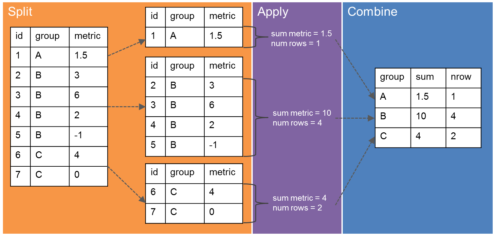

```{r setup, include=FALSE}
knitr::opts_chunk$set(echo = TRUE)
```

```{r}
# TO DO
# - add explanation for why summarize runs when you don't set a column name and explain issues with that method
# - add section about why piping a summarized data frame into another summarise function often does not work. This can also be a general discussion of order and expanded discussion of pipes
# - add some clarity around levels of grouping and why using ungroup() is often helpful
# - add more explanation of how group_by and mutate work together
# - explicitly state that na.rm must be inside the summary function NOT the summarize function alone
```


# Data Aggregation

When we have data, a common need is to condense many data points into useful pieces of information, such as descriptive statistics. We call this process data aggregation.

## Setup

First, we need to load out packages that we will be using for our lesson. Again, we will need `readr` and `dplyr`.

```{r}
library(readr)
library(dplyr)
```

Next, we read in our surveys data using the `read_csv()` function.

```{r}
surveys <- read_csv("surveys.csv")
```

## Split, Apply, Combine

One common way we analyze (and aggregate) data is through something we call the "split, apply, combine" approach. This means that we:

-   *split* data up into groups via some type of categorization
-   *apply* some type of analysis to each group independently and
-   *combine* the data back together



### Splitting by Group

In `dplyr`, we use a function called `group_by()` to perform the "split" task in "split, apply, combine."

For example, we can use this method to calculate values for every year from the surveys data frame. In this case, we would group by the year column.

Let's see what happens to the `surveys` dataframe when we group by the year column.

```{r}
surveys %>% 
  group_by(year)
```


The `group_by()` function doesn't seem to change the data frame visually in any way. However, you will notice that next to the information about the tibble (number of rows and columns), there is now an additional bit of information that tells us that this is now a grouped dataframe: grouped by the year column, and there are 26 groups.

In order to complete the "apply" and "combine" tasks, `group_by()` is most often paired with `mutate()` or `summarize()` functions.

## Combining `group_by()` and `summarize()`

Often times, we are interested in calculating summary statistics for our data, such as the mean, standard deviation, minimums, maximums, etc.

Fortunately, the `dplyr` has a handy-dandy function to make this easy to do with data frames. The `summarize()` function creates a new dataframe with columns and values we give it.

Similar to `mutate()`, what is on the left of the `=` is the name of the new column, and what is on the right of the `=` is the value(s) to put in the new column.

```{r}
surveys %>% 
  summarise(min_weight = min(weight, na.rm = TRUE))
```

After grouping a data frame, we can pipe it into a `summarize()` function to calculate values for *each group*. It will apply the function to each group and combine the results.

```{r}
surveys %>% 
  group_by(year) %>% 
  summarise(min_weight = min(weight, na.rm = TRUE))
```

As another example, we can use a new function (`n()`), which will count up the number of rows per group. That will give us the number of rodents caught during that year, which we will consider the abundance.

```{r}
surveys %>% 
  group_by(year) %>% 
  summarise(abundance = n())
```

### Grouping by Multiple Columns

To calculate the number of individuals caught in each plot for each year, we will want to group by both the year column and the plot_id column.

Let's start by putting only the group by function.

```{r}
surveys %>% 
  group_by(year, plot_id)
```

We can see that there are now 622 groups! Let's add our summarize function.

```{r}
surveys %>% 
  group_by(year, plot_id) %>% 
  summarize(abundance = n())
```

### Let's Practice

Start working on Question 1 and Question 2a-b.

## Some Additional Points

We can perform multiple calculations within the summarize function.

We’ll calculate the number of individuals in each plot year combination and their average weight.

```{r}
surveys %>% 
  group_by(year, plot_id) %>% 
  summarize(abundance = n(), 
            avg_weight = mean(weight))

# remove NAs
surveys %>% 
  group_by(year, plot_id) %>% 
  summarize(abundance = n(), 
            avg_weight = mean(weight, na.rm = TRUE))
```

How do we remove the NA values? We need to add the `na.rm = TRUE` argument to the `mean()` function.

You'll note that the data frame till has `NaN`. This is for cases where no individuals in that group have a weight. We can remove those values using `!is.na()`.

```{r}
# remove NAs using filter
surveys %>% 
  group_by(year, plot_id) %>% 
  summarize(abundance = n(), 
            avg_weight = mean(weight, na.rm = TRUE)) %>% 
  filter(!is.na(avg_weight))
```

Note the message about “grouped output.” It says that the resulting data frame is grouped by year. When we group by more than one column, the resulting data frame is grouped by all but the last group.

This can be useful in some more complicated circumstances, but it can also make things not work if functions that we want to use later don’t support grouped data frames.

If needed, we can remove these groups by adding an `ungroup()` function at the end of our pipeline.

```{r}
surveys %>% 
  group_by(plot_id, year) %>% 
  summarize(abundance = n(),
            avg_weight = mean(weight, na.rm = TRUE)) %>% 
  filter(!is.na(avg_weight)) %>% 
  ungroup()
```

The message still prints because it happens as part of the summarize step, but looking at the resulting data frame shows us that the final data frame is ungrouped.

### Let's Practice!

Try working on Question 2c.

## Using `group_by()` with `mutate()`

While we most commonly will use grouping before the summarize function, there are some occassions where using groups with the `mutate()` function can be particularly helpful.


You won't need to do this in your assignment, but you should know that it is possible!

Let's say we want to calculate the relative abundance of each species per year. As a reminder, the relative abundance is the total number of individuals of a species caught divided by the total number of rodents caught that year.

We will want want to calculate (a) the abundance of each species in each year, (b) the total number of rodents caught in that year, and (c) divide them.

```{r}
surveys %>% 
  group_by(year, species_id) %>% 
  # calculate the total number of individuals per species per year
  summarise(abundance = n()) %>% 
  # remove groups based on species_id (leave groups for each year)
  mutate(total_abund = sum(abundance), # total number caught per year
         relative_abund = abundance / total_abund) # relative abundance
```

### Let's Practice

Keep working on using `group_by()` and `summarise()` together with some other `dplyr` functions. Tackle Question 3.
