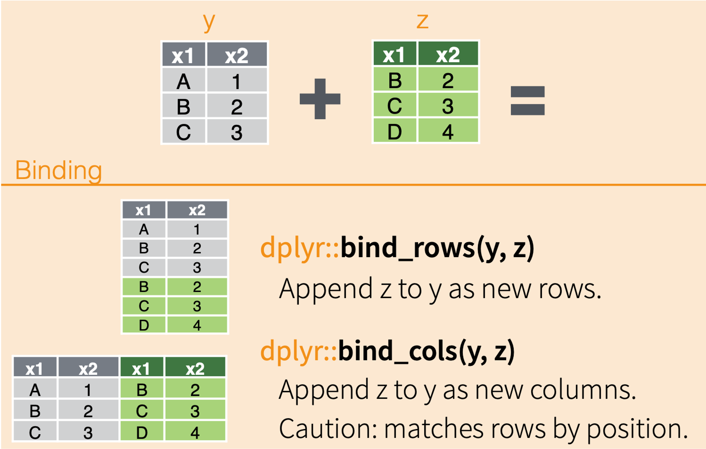
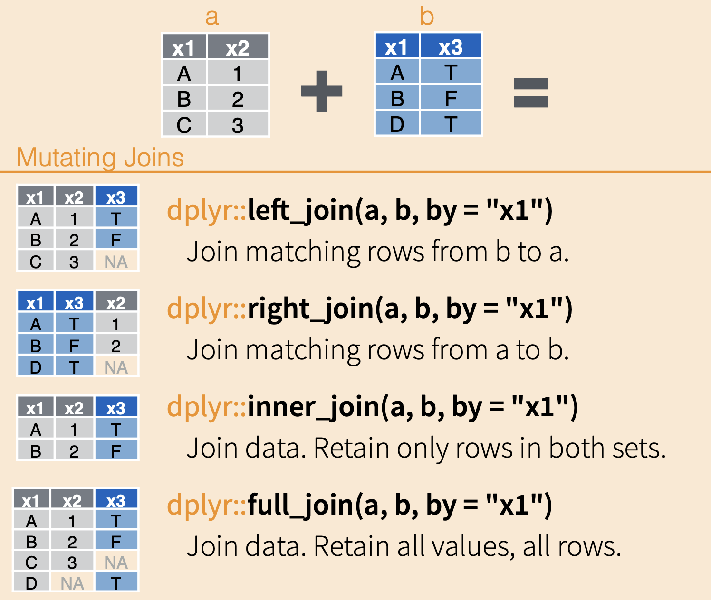

```{r setup, include=FALSE}
knitr::opts_chunk$set(echo = TRUE)
```

# Binds and Joins

In today's lesson, we will be talking about how to bring multiple data
frames together into one data frame.

Often times, we have a lot of data for one project that are related but
storing all of the data in one file would add unnecessary redundancy
(e.g., data in certain rows would need to be repeated too often). Other
times, data has been collected separately and needs to be combined
before analysis.

Being able to join together data from related tables is a key skill in
data science, and for working with larger data structures (databases
with their own languages, like SQL).

To understand binds and joins, we will continue using the Portal
datasets.

## Set-up

Let's go ahead and load our usual packages.

```{r}

```

And load the `surveys`, `species`, and `plots` data.

```{r}

```

## Binds vs. Joins

We have 2 main methods of combining datasets: binds and joins. They work
in different ways.

### Binds

One way we can combine data sets in through binds. Binds act similarly
to gluing datasets together instead of sorting rows to match up.

They don't match up data based on unique identifiers; instead they match
up data by column name (`bind_rows`) or row position (`bind_cols`).

{width="50%"}

These can be very useful, but you need to be careful using them,
especially `bind_cols`, as the function will automatically assume that
the rows are in the correct positions.

Let's work with an example.

The `surveys` data only goes through 2002, but we have a lot more data
from the site! Let's pull down all of the rodent data since 2002 from
the [`portalr` package](https://weecology.github.io/portalr/), a package the Weecology lab made to make working with the (actual) Portal data a bit easier. Run the following code chunk.

```{r}
# load our packages
library(portalr)

# load the new rodent data and do a little cleaning
# don't worry if you don't know what every bit of code is doing, though some of it should look familiar!
new_rodents <- summarize_individual_rodents() %>% 
  select(month, day, year, plot_id = plot, species_id = species, sex, hindfoot_length = hfl, weight = wgt) %>% 
  filter(year > 2002) %>% 
  mutate(record_id = seq(nrow(surveys) + 1, nrow(surveys) + nrow(.))) %>% 
  as_tibble()
new_rodents
```

When we look at the `new_rodents` data frame, we can see the same
columns as in `surveys`, though the `record_id` column is at the end.

We want to bind these two data frames together so that we have *all* of
the rodent data in one data frame. To do so, we would use `bind_rows()`.
Even though columns are getting matched up, the things we are binding
together are multiple rows, hence `bind_rows()`.

The arguments for both `bind_rows()` and `bind_cols()` are the names of
the data frames you want to bind together.

```{r}

```

Notice that the data has been successfully rearranged to have the
columns match up. This will only happen if the columns have the *exact*
same names.

### Let's Practice!

Try your hand at Question 6 on the assignment.

## Joins

### Multiple Data Tables

When we talked about data structure, one of the things we discussed was
splitting data into multiple tables. This lets us avoid unnecessary
redundant information, like listing the full taxonomy for every
individual of a species. This, in turn, makes storage more efficient and
allows us to make changes in one place, not hundreds of places.

Our goal is for each table to contain a single kind of information.

Let’s look at this in the Portal dataset.

```{r}

```

In the Portal dataset:

-   `surveys`: information about individuals
-   `species`: information about species
-   `plots`: information about plots

This way, if a species name changes (for example), we only need to
change it in the species table rather than tens of thousands of times.

When we need to combine the datasets together to use data from multiple
data frames, we use a join function.

### How Joins Work

Joins are arguably the more complicated of the two types of ways to
combine data, but they are, therefore, the more flexible and useful of
the two.

The magic comes because they *match up columns of data based on unique
identifiers in each row of data*.

In the following diagram, the two example data frames have the column
`x1` in common, and each of the values in `x1` are unique (no repeats in
the same data frame). When combining the datasets, all of the columns
are added, and their rows are matched up to their respective values in
the `x1` column.

This can happen a couple ways, depending on which data frame is the
reference and how much data you want to retain.

{width="50%"}

To enable us to make these connections, the tables need one (or more)
columns that link them together.

In the case of the Portal data, there is one column that links the
`surveys` and `species` tables: `species_id`

There is also one column that links the `surveys` and `plots` tables:
`plot_id`

Let’s join the surveys and the species tables together using an “inner
join.”

To do this, we use the inner_join function from `dplyr`. It takes three
arguments:

1)  The first of the two tables we want to join
2)  The second of the two tables we want to join
3)  The column, or columns, that provide the linkage between the two
    tables, specified in a `join_by()` function,

```{r}

```

Looking at the combined table, we can see that on every row with a
particular value for `species_id`, the join has added the matching
values on `genus`, `species`, and `taxa`.

One way to think about this join is that it adds the relevant
information in the species table to the surveys table. Often for
scientific data we can think about there being one main table, the
surveys table in our case, and multiple supplementary tables that
provide additional details.

Inner joins keep information from both tables when both tables have a
matching value in the join column.

Let's go back up and look at the visualization of the inner join. When
we use the `inner_join` function to merge together table a and b, the
result only has rows for which the common column (`x1`) have the same
values in each table (A and B).

Translating this to the rodent data, that means that we dropped any rows
for which there is no matching `species_id`.

Scroll to Line 324 in the `surveys` table; these have missing species
IDs. If you look in the `combined` table, ou'll notice that `record_id`,
324-326 are missing from the table.

The other join functions might have handled this differently, based on
how they work.

For example, left joins keep all rows in the first, or left, table. If
we wanted to keep rows with missing species IDs in the `surveys` data
frame, we could use `left_join()`.

```{r}

```

There are also right joins, which keep all rows in the second (or right)
table, and full joins, which keep all rows from both tables, even there
isn't a matching row.

For our exercises, we’ll focus on using inner joins.

## Multi-table Joins

Sometimes, we need to combine more than two tables.

To join more than two tables, we start by joining two tables, then join
the resulting table to a third table, and so on.

For Portal, we could start by joining the `surveys` and the `species`
tables. We can then combine the resulting table with the `plots` table
to get a fully merged data frame.

```{r}

```

If it helps you to keep track of which data tables are being joined when
(especially for left and right joins), you can also use the placeholder
for your chosen pipe.

```{r}

```

### Let's Practice

You should be able to complete Questions 4, 5, and 7
