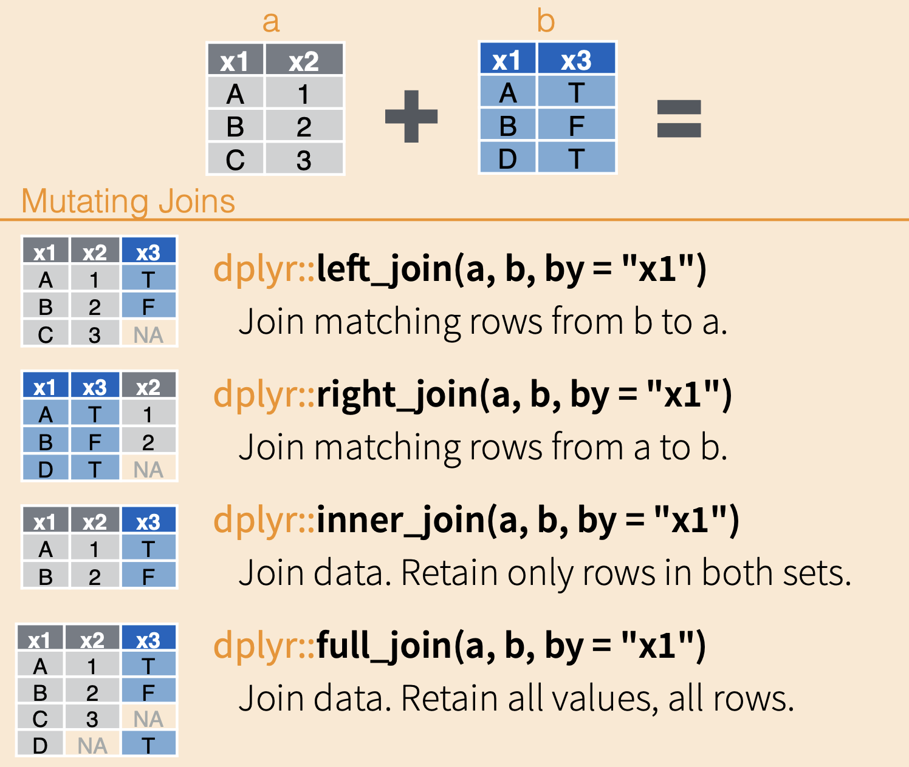

```{r setup, include=FALSE}
knitr::opts_chunk$set(echo = TRUE)
```

# Binds and Joins

In today's lesson, we will be talking about how to bring multiple data
frames together into one data frame.

Often times, we have a lot of data for one project that are related but
storing all of the data in one file would add unnecessary redundancy
(e.g., data in certain rows would need to be repeated too often). Other
times, data has been collected separately and needs to be combined
before analysis.

Being able to join together data from related tables is a key skill in
data science, and for working with larger data structures (databases
with their own languages, like SQL).

We are going to use two different datasets to explore binds and joins.
For binds, we are going to continue to use the Portal data with which we
have become quite familiar. For joins, we will use rodent capture data
from Organ Pipe National Monument; you'll use the Portal data for joins
in your assignment.

## Set-up

Let's go ahead and load our usual packages.

```{r}
# load packages
library(dplyr)
library(readr)
```

To start, let's read in the `surveys` dataframe from the Portal dataset.

```{r}
surveys <- read_csv("surveys.csv")
```

## Binds vs. Joins

We have 2 main methods of combining datasets: binds and joins. They work
in different ways.

## Binds

One way we can combine data sets in through binds. Binds act similarly
to gluing datasets together instead of sorting rows to match up based on
unique identifiers ("keys).

{width="50%"}

For `bind_rows()`:

-   we are stacking datasets on top of each other vertically

-   columns are matched by name (not position); a column missing in one
    dataset will be filled with NAs

-   often used when you have multiple datasets with the same structure

For `bind_col()`:

-    we are putting datasets beside each other horizontally

-   rows are matched by position, not by unique values

-   datasets must have the same number of rows

These can be very useful, but you need to be careful using them,
especially `bind_cols`, as the function will automatically assume that
the rows are in the correct positions.

Let's work with an example.

The `surveys` data only goes through 2002, but we have a lot more data
from the site! Let's pull down all of the rodent data since 2002 from
the [`portalr` package](https://weecology.github.io/portalr/), a package
the Weecology lab made to make working with the (actual) Portal data a
bit easier. Run the following code chunk.

```{r}
# load our package
library(portalr)

# load the new rodent data and do a little cleaning
# don't worry if you don't know what every bit of this code is doing, 
# though some of it should look familiar :)
new_rodents <- summarize_individual_rodents() %>% 
  select(month, day, year, plot_id = plot, species_id = species, 
         sex, hindfoot_length = hfl, weight = wgt) %>% 
  filter(year > 2002) %>% 
  mutate(record_id = seq(nrow(surveys) + 1, 
                         nrow(surveys) + nrow(.))) %>% 
  tibble::as_tibble()
new_rodents
```

When we look at the `new_rodents` data frame, we can see the same
columns as in `surveys`, though the `record_id` column is at the end.

We want to bind these two data frames together so that we have *all* of
the rodent data in one data frame. To do so, we would use `bind_rows()` because we want to "vertically" stack these data frames together since they share the same columns.

The arguments for both `bind_rows()` and `bind_cols()` are the names of
the data frames you want to bind together.

```{r}
all_rodents <- bind_rows(surveys, new_rodents)

head(all_rodents)
tail(all_rodents)
```

Notice that the data has been successfully rearranged to have the
columns match up. This will only happen if the columns have the *exact*
same names.

### Let's Practice!

Try your hand at Question 6 on the assignment.

## Joins

### Multiple Data Tables

When we talked about data structure, one of the things we discussed was
splitting data into multiple tables. This lets us avoid unnecessary
redundant information, like listing the full taxonomy for every
individual of a species. This, in turn, makes storage more efficient and
allows us to make changes in one place, not hundreds of places.

Our goal is for each table to contain a single kind of information.

Let’s take a look at this using the rodent capture data from Organ Pipe National Monument.

First, we need to read in all four data tables.
```{r}
rodent_detail <- read_csv("ORPI_RodentDetail.csv") 
rodent_survey <- read_csv("ORPI_RodentSurvey.csv")
rodent_species <- read_csv("ORPI_RodentSpecies.csv")
rodent_site <- read_csv("ORPI_Site.csv")
```

In these four datasets, we have the following:

-   `rodent_detail`: data about each individual rodent caught
-   `rodent_survey`: data about each survey occasion
-   `rodent_species`: data about each rodent species
-   `rodent_site``: data about rodent trapping sites

This way, if a species name changes (for example), we only need to
change it in the species table rather than tens of thousands of times.

When we need to combine the datasets together to use data from multiple
data frames, we use a `join` function.

Take a few minutes to examine these data tables. Each data frame shares at least one column with another data frame (though the column names may or may not match...).

### How Joins Work

Joins are arguably the more complicated of the two types of ways to
combine data, but they are, therefore, the more flexible and useful of
the two.

The magic comes because they merge datasets by *matching up columns of data based on unique
identifiers ("keys") in each row of data*.

In the following diagram, the two example data frames have the column
`x1` in common, and each of the values in `x1` are unique (no repeats in
the same data frame). When combining the datasets, all of the columns
are added, and their rows are matched up to their respective values in
the `x1` column.

This can happen a couple ways, depending on which data frame is the
reference and how much data you want to retain.

Depending on the type of join you use, you will keep all rows from table (`left_join` and `right_join`), both tables (`full_join`), or only rows with matches (`inner_join`).

{width="50%"}

You can find another way to visualize what happens during different type
of joins through GIFs from
[tidyexplain](https://www.garrickadenbuie.com/project/tidyexplain/).

To enable us to make these connections, the tables need one (or more)
columns that link them together; these are the "keys."


#### Inner Joins

Inner joins keep only rows that have a match in both data frames.

Let’s join the `rodent_detail` and `rodent_species` tables together using an “inner
join.”

To do this, we use the `inner_join` function from `dplyr`. It takes
three arguments:

1)  The first of the two tables we want to join
2)  The second of the two tables we want to join
3)  The column, or columns, that provide the linkage between the two
    tables, specified in a `join_by()` function,

```{r}
inner <- inner_join(rodent_detail, rodent_species, join_by(RodentSpeciesID))
inner
```

Looking at the combined table, we can see that on every row in `rodent_detail` with a
particular value for `RodentSpeciesID` column, the join has added the matching
values from `rodent_species`, including the species code, scientific name, and family.

One way to think about this join is that it adds the relevant
information in the `rodent_species` table to the `rodent_details` table. 

Let's go back up and look at the visualization of the inner join. When
we use the `inner_join` function to merge together table a and b, the
result only has rows for which the common column (`x1`) have the same
values in each table (A and B).

Translating this to the rodent data, that means that we dropped any rows
for which there is no matching `RodentSpeciesID`.

RecordID 7 in the `rodent_detail` table has a missing species ID. If you look in the `inner` table, you'll notice that in the `RecordID` column, number 7 is missing.

The other join functions might have handled this differently, based on
how they work.

#### Left Joins

For example, left joins keep all rows in the first, or left, table. If
we wanted to keep rows with missing species IDs in the `rodent_detail` data
frame, we could use `left_join()`.

```{r}
left <- left_join(rodent_detail, rodent_species, join_by(RodentSpeciesID))
left
```
Because there are no values in the `rodent_species` table that correspond to a missing`RodentSpeciesID`, the columns from that table are filled with NA values in the rows with no match.

There are also right joins, which keep all rows in the second (or right)
table, and full joins, which keep all rows from both tables, even there
isn't a matching row.

#### Full Join

To demonstrate a full join, we are going to use the other two tables: `rodent_survey` and `rodent_site`.

Our first step is to identify the uniting column, or "key." In this case, the columns do not share the same name, but they do share the same data. We can successfully join them by setting the column names equal to each other in the `join_by()` function with `==`.

```{r}
# to join tables when the key column(s) have different names: 
# set the columns equal to each other in the join_by() function with ==
# put them in the same order as the data frames are listed in the function
full <- full_join(rodent_survey, rodent_site, join_by(SiteID == SiteCode))
full

# older notation for combining tables with columns with different names
# full_join(rodent_survey, rodent_site, by = c("SiteID" = "SiteCode"))
```


Note: for our assignment, we’ll focus on using inner joins.

### Multi-table Joins

Sometimes, we need to combine more than two tables.

To join more than two tables, we start by joining two tables, then join
the resulting table to a third table, and so on.

Let's combine _all four_ tables from Organ Pipe!

```{r}
all_ORPI_data <- rodent_detail %>% 
  inner_join(rodent_species, join_by(RodentSpeciesID)) %>% 
  inner_join(rodent_survey, join_by(RodentSurveyID == SurveyID)) %>% 
  inner_join(rodent_site, join_by(SiteID == SiteCode))
```

If it helps you to keep track of which data tables are being joined when, you can also use the placeholder for your chosen pipe (`.` for ` %>% `; `x = _` for `|>`).

```{r}
all_ORPI_data <- rodent_detail %>% 
  inner_join(., rodent_species, join_by(RodentSpeciesID)) %>% 
  inner_join(., rodent_survey, join_by(RodentSurveyID == SurveyID)) %>% 
  inner_join(., rodent_site, join_by(SiteID == SiteCode))

# the placeholder for the native pipe has to be used in a named argument
# the names of the arguments for the two data frames in a join are `x` and `y`
all_ORPI_data <- rodent_detail |>
  inner_join(x = _, rodent_species, join_by(RodentSpeciesID)) |> 
  inner_join(x = _, rodent_survey, join_by(RodentSurveyID == SurveyID)) |>
  inner_join(x = _, rodent_site, join_by(SiteID == SiteCode))
```

### Let's Practice

You should be able to complete Questions 4, 5, and 7
