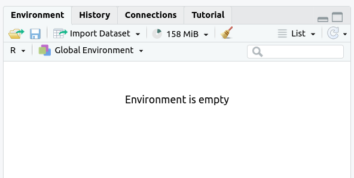
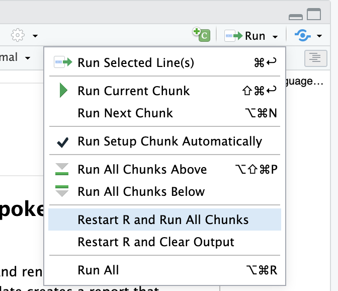

```{r setup, include=FALSE}
knitr::opts_chunk$set(echo = TRUE)
```

# Week 5 Assignment

# Assignment Exercises

### Set-up

Load the packages we will need. You can either load all of them individually (`readr`, `dplyr`, `ggplot2`) or load the `tidyverse` package.

```{r}
library(tidyverse)
```

### 1. Acacia and Ants (20 pts)

Read in the acacia data frame by running the following code chunk.

```{r}
acacia <- read_tsv("ACACIA_DREPANOLOBIUM_SURVEY.txt", na = c("", "dead"))
```

a.  Make a scatter plot with `CIRC` on the x axis and `AXIS1` (the maximum canopy width) on the y axis. Label the x axis "Circumference" and the y axis "Canopy Diameter".
b.  The same plot as (a), but with both axes scaled logarithmically (using `scale_x_log10` and `scale_y_log10`).
c.  The same plot as (a), but with points colored based on the `ANT` column (the species of ant symbiont living with the acacia)
d.  The same plot as (c), but instead of different colors show different species of ant (values of `ANT`) each in a separate subplot.
e.  The same plot as (d) but add a simple model of the data by adding `geom_smooth`.

```{r}
# 1a
print("1a")
ggplot(data = acacia, mapping = aes(x = CIRC, y = AXIS1)) +
  geom_point() +
  labs(x = "Circumference", y = "Canopy Diameter")
#ggsave("Graphing-acacia-ants-R-1.jpeg")

# 1b
print("1b")
ggplot(data = acacia, mapping = aes(x = CIRC, y = AXIS1)) +
  geom_point() +
  scale_x_log10() +
  scale_y_log10() +
  labs(x = "Circumference", y = "Canopy Diameter")
#ggsave("Graphing-acacia-ants-R-2.jpeg")

# 1c
print("1c")
ggplot(data = acacia, mapping = aes(x = CIRC, y = AXIS1, color = ANT)) +
  geom_point() +
  labs(x = "Circumference", y = "Canopy Diameter")
#ggsave("Graphing-acacia-ants-R-3.jpeg")

# 1d
print("1d")
ggplot(data = acacia, mapping = aes(x = CIRC, y = AXIS1)) +
  geom_point() +
  labs(x = "Circumference", y = "Canopy Diameter") +
  facet_wrap(~ANT)
#ggsave("Graphing-acacia-ants-R-4.jpeg")

# 1e
print("1e")
ggplot(data = acacia, mapping = aes(x = CIRC, y = AXIS1)) +
  geom_point() +
  labs(x = "Circumference", y = "Canopy Diameter") +
  facet_wrap(~ANT) +
  geom_smooth()
#ggsave("Graphing-acacia-ants-R-5.jpeg")
```

### 2. Mass vs. Metabolism (20 pts)

The relationship between the body size of an organism and its metabolic rate is one of the most well studied and still most controversial areas of organismal physiology. We want to graph this relationship in the [Artiodactyla](http://en.wikipedia.org/wiki/Even-toed_ungulate) using a subset of data from a large compilation of body size data ([Savage et al. 2004](https://doi.org/10.1111/j.0269-8463.2004.00856.x)). Run this code chunk to get started.

```{r}
# create a data frame with 3 columns: body_mass, metabolic_rate, and family
size_mr_data <- data.frame(
  body_mass = c(32000, 37800, 347000, 4200, 196500, 100000,
    4290, 32000, 65000, 69125, 9600, 133300, 150000, 407000,
    115000, 67000,325000, 21500, 58588, 65320, 85000, 135000,
    20500, 1613, 1618),
  metabolic_rate = c(49.984, 51.981, 306.770, 10.075, 230.073, 
    148.949, 11.966, 46.414, 123.287, 106.663, 20.619, 180.150, 
    200.830, 224.779, 148.940, 112.430, 286.847, 46.347,
    142.863, 106.670, 119.660, 104.150, 33.165, 4.900, 4.865),
  family = c("Antilocapridae", "Antilocapridae", "Bovidae",
    "Bovidae", "Bovidae", "Bovidae", "Bovidae", "Bovidae",
    "Bovidae", "Bovidae", "Bovidae", "Bovidae", "Bovidae",
    "Camelidae", "Camelidae", "Canidae", "Cervidae",
    "Cervidae", "Cervidae", "Cervidae", "Cervidae", "Suidae",
    "Tayassuidae", "Tragulidae", "Tragulidae"))
```

Make the following plots with appropriate axis labels:

a.  A plot of body mass vs. metabolic rate
b.  A plot of body mass vs. metabolic rate, with log10 scaled axes (this stretches the axis, but keeps the numbers on the original scale), and the point size set to 3.
c.  The same plot as (b), but with the different families indicated using color.
d.  The same plot as (b), but with the different families each in their own subplot.

```{r}
# 2a.  A graph of body mass vs. metabolic rate
print("2a")
ggplot(size_mr_data, aes(body_mass, metabolic_rate)) + geom_point() +
  labs(x = "Body Mass", y = "Metabolic Rate")

# 2b.  A graph of body mass vs. metabolic rate, log scaled, with pt size 5.
print("2b")
ggplot(data = size_mr_data, mapping = aes(x = body_mass, y = metabolic_rate)) +
  geom_point(size=3) +
  labs(x = "Body Mass", y = "Metabolic Rate") +
  scale_x_log10() + scale_y_log10()

# c. The same plot as (2), but with the different families indicated using color.
print("2c")
ggplot(size_mr_data, aes(x = body_mass, y = metabolic_rate, color = family)) +
  geom_point(size = 3) +
  scale_x_log10() +
  scale_y_log10() +
  labs(x = "Body Mass", y = "Metabolic Rate")

# d. The same plot as (2), but with the different families each in their own subplot.
print("2d")
ggplot(size_mr_data, aes(x = body_mass, y = metabolic_rate)) +
  geom_point(size = 3) +
  scale_x_log10() +
  scale_y_log10() +
  facet_wrap(~family) +
  labs(x = "Body Mass", y = "Metabolic Rate")
```

### 3. Acacia and Ants Histograms (20 pts)

In this exercise, we will be making a number of different histograms with the `acacia` dataset.

a.  Make a bar plot of the number of acacia with each mutualist ant species (using the `ANT` column).
b.  Make a histogram of the height of acacia (using the `HEIGHT` column). Label the x axis "Height (m)" and the y axis "Number of Acacia".
c.  Make a plot that shows histograms of both `AXIS1` and `AXIS2`. Due to the way the data are structured, you’ll need to add a 2nd geom_histogram() layer that specifies a new aesthetic. To make it possible to see both sets of bars you’ll need to make them transparent with the optional argument `alpha = 0.3`. Set the color for `AXIS1` to "red" and `AXIS2` to "black" using the `fill` argument. Label the x axis "Canopy Diameter (m)" and the y axis "Number of Acacia".
d.  Use `facet_wrap()` to make the same plot as (c) but with one subplot for each treatment. Set the number of bins in the histogram to 10.

```{r}
# 3a
print("3a")
ggplot(data = acacia, mapping = aes(x = ANT)) +
  geom_bar()
#ggsave("Graphing-acacia-ants-histograms-R-1.jpeg")

# 3b
print("3b")
ggplot(data = acacia, mapping = aes(x = HEIGHT)) +
  geom_histogram() +
  labs(x = "Height(m)", y = "Number of Acacia")
#ggsave("Graphing-acacia-ants-histograms-R-2.jpeg")

# 3c
print("3c")
ggplot(data = acacia) +
  geom_histogram(mapping = aes(x = AXIS1), fill = 'red', alpha = 0.3) +
  geom_histogram(mapping = aes(x = AXIS2), fill = 'black', alpha = 0.3) +
  labs(x = "Canopy Diameter", y = "Number of Acacia")
#ggsave("Graphing-acacia-ants-histograms-R-3.jpeg")

# 3d
print("3d")
ggplot(data = acacia) +
  geom_histogram(mapping = aes(x = AXIS1), fill = 'red', alpha = 0.3, bins = 10) +
  geom_histogram(mapping = aes(x = AXIS2), fill = 'black', alpha = 0.3, bins = 10) +
  labs(x = "Canopy Diameter", y = "Number of Acacia") +
  facet_wrap(~TREATMENT)
#ggsave("Graphing-acacia-ants-histograms-R-4.jpeg")
```

### 4. Acacia and Ants Data Manipulation (20 pts)

Run the following line of code to use `read_tsv` from the `readr` package to read in the data from "TREE.txt". This line of code is using the `col_types` argument to specify the the `HEIGHT` and `AXIS_2` columns should have their data read is as the data class "double," which is like "numeric."

You'll see a warning when you read in the data. You can ignore it.

```{r}
trees <- read_tsv("TREE.txt",
                  col_types = list(HEIGHT = col_double(),
                                   AXIS_2 = col_double())) |> drop_na(TREATMENT)
```

Now that you have the `trees` data frame, do the following:

a.  Update the `trees` data frame with a new column named `canopy_area` that contains the estimated canopy area calculated as the value in the `AXIS_1` column times the value in the `AXIS_2` column.
b.  Show output of the `trees` data frame with just the `SURVEY`, `YEAR`, `SITE`, and `canopy_area` columns (do not overwrite the `trees` object, though).
c.  Make a scatter plot with `canopy_area` on the x axis and `HEIGHT` on the y axis. Color the points by `TREATMENT` and plot the points for each value in the `SPECIES` column in a separate subplot. Label the x axis "Canopy Area (m)" and the y axis "Height (m)". Make the point size 2.
d.  That's a big outlier in the plot from (c). 50 by 50 meters is a little too big for a real Acacia, so filter the data to remove any values for `AXIS_1` and `AXIS_2` that are over 20 and update the data frame. Then remake the graph.
e.  Using the data without the outlier (i.e., the data generated in (d)), find out how the abundance of each species has been changing through time. Use `group_by`, `summarize`, and `n` to make a data frame with `YEAR`, `SPECIES`, and an `abundance` column that has the number of individuals in each species in each year. Print out this data frame.
f.  Using the data frame generated in (e), make a line plot with points (by using `geom_line` in addition to `geom_point`) with `YEAR` on the x axis and `abundance` on the y axis with one subplot per species. To let you seen each trend clearly let the scale for the y axis vary among plots by adding `scales = "free_y"` as an optional argument to `facet_wrap`.

```{r}

# 4a
print("4a")
trees <- mutate(trees, canopy_area = AXIS_1 * AXIS_2)
trees

# 4b
print("4b")
select(trees, SURVEY, YEAR, SITE, SPECIES, canopy_area)

# 4c
print("4c")
ggplot(data = trees, mapping = aes(x = canopy_area, y = HEIGHT, color = TREATMENT)) + 
  geom_point(size = 2) +
  labs(x = "Canopy Area (m)", y = "Height (m)") +
  facet_wrap(~SPECIES)
#ggsave("Graphing-acacia-ants-data-manip-R-2.jpeg")

# 4d
print("4d")
trees <- filter(trees, AXIS_1 < 20, AXIS_2 < 20)
ggplot(data = trees, mapping = aes(x = canopy_area, y = HEIGHT, color = TREATMENT)) + 
  geom_point(size = 2) +
  labs(x = "Canopy Area (m)", y = "Height (m)") +
  facet_wrap(~SPECIES)
#ggsave("Graphing-acacia-ants-data-manip-R-3.jpeg")

# 4e
print("4e")
abundance_time <- trees %>%
  group_by(YEAR, SPECIES) %>%
  summarize(abundance = n())
abundance_time

# 4f
print("4f")
ggplot(data = abundance_time, mapping = aes(x = YEAR, y = abundance)) +
  geom_point() +
  geom_line() +
  facet_wrap(~SPECIES, scales = "free_y")
#ggsave("Graphing-acacia-ants-data-manip-R-5.jpeg")

```

### 5. Adult vs. Newborn Size (20 pts)

Larger organisms have larger offspring. We want to explore the form of this relationship in mammals.

First, read in the data frame with the code below and take a look at the dataframe. Do you see any issues that need to be addressed?

```{r}
read_tsv("Mammal_lifehistories_v2.txt")
```

The code below will read in the dataset and save it as the object `mammal_histories`. You should recognize the `na` argument in the `read_tsv()` function; this will handle our -999 values and convert them to NAs. This code also uses a handy function called `rename` from the `tidyverse` to rename columns, removing any special characters.

```{r}
mammal_histories <- read_tsv("Mammal_lifehistories_v2.txt", 
                             na = c("-999", "-999.00")) %>% 
  rename(mass_g = `mass(g)`, 
         gestation_mo = `gestation(mo)`,
         newborn_g = `newborn(g)`,
         weaning_mo = `weaning(mo)`,
         wean_mass_g = `wean mass(g)`,
         AFR_mo = `AFR(mo)`,
         max_life_mo = `max. life(mo)`,
         litter_size = `litter size`,
         litters_per_year = `litters/year`)

mammal_histories
```

a.  Graph adult mass vs. newborn mass. Label the axes with clearer labels than the column names.
b.  It looks like there's a regular pattern here, but it's definitely not linear. Let's see if log-transformation straightens it out. Graph adult mass vs. newborn mass, with both axes scaled logarithmically. Label the axes.
c.  This looks like a pretty regular pattern, so you wonder if it varies among different groups. Graph adult mass vs. newborn mass, with both axes scaled logarithmically, and the data points colored by order. Label the axes.
d.  Coloring the points was useful, but there are a lot of points and it's kind of hard to see what's going on with all of the orders. Use `facet_wrap` to create a subplot for each order.
e.  Now let's visualize the relationships between the variables using a simple linear model. Create a new graph like your faceted plot, but using `geom_smooth` to fit a linear model to each order. You can do this using the optional argument `method = "lm"` in `geom_smooth`.

```{r}
# a. Graph adult mass vs. newborn mass.
print("5a")
ggplot(mammal_histories, aes(x = mass_g, y = newborn_g)) +
  geom_point() + 
  labs(x = "Adult Mass", y = "Newborn Mass")

# b. Graph adult mass vs. newborn mass, with both axes scaled logarithmically.
print("5b")
ggplot(mammal_histories, aes(x = mass_g, y = newborn_g)) +
  geom_point() + 
  scale_x_log10() + 
  scale_y_log10() +
  labs(x = "Adult Mass", y = "Newborn Mass")

# c. Graph adult mass vs. newborn mass, log-scaled, with data colored by order.
print("5c")
ggplot(mammal_histories, aes(x = mass_g, y = newborn_g)) +
  geom_point(aes(color=order)) + 
  scale_x_log10() + 
  scale_y_log10() +
  labs(x = "Adult Mass", y = "Newborn Mass")

# d. Use `facet_wrap` to create subplot for each order.
print("5d")
ggplot(mammal_histories, aes(x = mass_g, y = newborn_g)) +
  geom_point() + 
  scale_x_log10() + 
  scale_y_log10() + 
  facet_wrap(~ order) +
  labs(x = "Adult Mass", y = "Newborn Mass")

# e. use `geom_smooth` to fit a linear model to each order.
print("5e")
ggplot(mammal_histories, aes(x = mass_g, y = newborn_g)) +
  geom_point() + 
  geom_smooth(method = "lm") + 
  scale_x_log10() +
  scale_y_log10() + 
  facet_wrap(~ order) +
  labs(x = "Adult Mass", y = "Newborn Mass")
```

### 6. Check That Your Code Runs

Sometimes we think our code runs, but it only actually works because of something else we did previously.

To make sure it actually runs, you should save your work and then run it in a clean (read: empty) environment.

I have actually be forcing the issue by having you "knit" your file before submitting it. To successfully knit, every RMarkdown file must be "self-contained," meaning every line of code that is necessary to run anything in the .Rmd file must be written in the .Rmd file. The file doesn't recognize things already in the environment.

For example, if you use a function from the `readr` package (e.g., `read_csv`) anywhere in your .Rmd file, you will need to have `library(readr)` in a code chunk in your .Rmd file before any line with `read_csv`.

Similarly, if you have a line of code referencing an object (like a data frame), you need to have a line of code beforehand in your .Rmd file that creates the object.

While attempting to knit a document is one way to learn if your code actually runs the way you think it should, there are other (and maybe better) ways to test this out before you ever try to knit a document.

Follow these steps in RStudio to make sure your code really runs:

1.  Restart R by clicking `Session` in the menu bar and selecting `Restart R`.

 2. If the `Environment` tab isn’t empty, click on the broom icon to clear it.


The `Envirnment` tab should now say "Environment is empty."

 3. Run all of the code you have written in your assignment so far by selecting `Restart R and Run All Chunks`,`Run All`, or using the keyboard shortcut (`Ctrl`+`Alt`+`R` or `Cmd`+`Opt`+`R`)

 If your code does *not* run all the way through, check the error messages. This will helpful you isolate the potential issue.

No need to type any answers here. If you are able to submit a PDF, you're good to go.

### 7. Graphing Data from Multiple Tables (*Optional*)

This questions uses the `acacia` and `trees` data frames.

We want to compare the circumference to height relationship in acacia on different treatments in the context of the same relationship for trees in the region.

Make a graph with the relationship between `CIRC` and `HEIGHT` for the trees as gray points in the background and the same relationship for acacia as red points plotted on top of the tree points.

There should be one subplot for each treatment. Scale the both axes logarithmically. Include linear models for both sets of data. Provide clear labels for the axes. Add a theme.

```{r, message=FALSE, warning=FALSE}
ggplot() +
  geom_point(data = trees, aes(x = CIRC, y = HEIGHT), color = "gray") +
  geom_smooth(data = trees, aes(x = CIRC, y = HEIGHT), color = "black", method = "lm") +
  geom_point(data = acacia, aes(x = CIRC, y = HEIGHT), color = "red") +
  geom_smooth(data = acacia, aes(x = CIRC, y = HEIGHT), color = "red", method = "lm") +
  facet_wrap(~ TREATMENT) +
  labs(x = "Circumfrence (cm)",
       y = "Height (m)") +
  scale_x_log10() +
  scale_y_log10() +
  theme_light()
```
