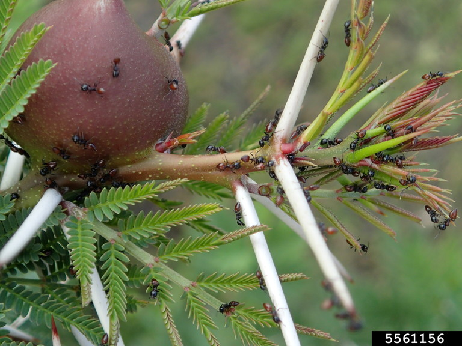

```{r setup, include=FALSE}
knitr::opts_chunk$set(echo = TRUE)
```

# Data Visualization

This week, we will be focusing on how to build plots in R with another package in the `tidyverse` called `ggplot2`.

While we won't use any `dplyr` functions during the lesson, we will use a few of them in this week's assignment. That means that we are now using 3 different packages from the `tidyverse`.

## Load the `tidyverse`

Up until now, I've had us load in each package we've been using by name. This is helpful for learning which package each function is coming from. However, now that we are using 3 (and eventually more) packages from the `tidyverse`, we can start loading the entire `tidyverse` instead of each package individually.

As a reminder, the `tidyverse` is a package (more accurately, a set of packages) offered in R that all have similar goals and a unified syntax designed to work particularly well with 2-dimensional data (data with rows and columns).

I have already installed the `tidyverse` package in Posit Cloud, but I will put the code here for reference.

```{r}
#install.packages("tidyverse")
```

Now, let's load the `tidyverse` package this time and see what happens.

```{r}
library(tidyverse)
```

This message is telling us that we have now loaded the following packages into our workspace: `dplyr`, `forcats`, `ggplot2`, `lubridate`, `purrr`, `readr`, `stringr`, `tibble`, and `tidyr`. By the end of the course, we will have used functions from \~6 of these packages.

This specific lesson will be using `readr` and `ggplot2`.

The message also gives us some information about functions from `dplyr` that have the same name as functions from the default packages that come with R and that the `dplyr` ones will now be the default.

## Introduction to the UHURU dataset

### Data

For the this week's lesson and assignment, we'll be working with data on acacia size from an [experimental site in Kenya](https://mpala.org/science/savannah-ecology/ungulate-herbivory-under-rainfall-uncertainty/). The experiment is designed to understand the influence of herbivores on vegetation by excluding herbivores of different sizes (also across a rainfall gradient).

There are 3 different treatments and 1 control:

-   The top-left image shows *megaherbivore exclosures*, which use wires 2m high to keep out animals like elephants and giraffes.
-   The top-right image shows *mesoherbivore exclosures*, which use fences starting 1/3m off the ground to exclude things like impala.
-   The bottom-left image shows *full exclosures*, which use fences all the way to the ground to keep out all mammalian herbivores.
-   The bottom-right image shows *control plots*


### Download the Data

First, let's download the data from the UHURU into Posit Cloud.

```{r}
download.file("https://ndownloader.figshare.com/files/5629542",
              "ACACIA_DREPANOLOBIUM_SURVEY.txt")
download.file("https://ndownloader.figshare.com/files/5629536",
              "TREE.txt")
```

So far we've been working with datasets that are separated by commas, saved as .csv files. This dataset, however, is a bit different.

When we open this data, we can see that the data are separated by tabs. We can also see that the dataset is not a .csv file but rather a .txt (or "text" file).

In order to read this data into our working environment, we will use another function from the `readr` package: `read_tsv()` ("read tab-separated values").

```{r}
acacia <- read_tsv("ACACIA_DREPANOLOBIUM_SURVEY.txt")
```

When we take a look at the data, we can also see that it includes information on whether or not the plant is dead in the `HEIGHT` column.

First of all, is this good data structure? Why or why not?

For now, we'll just treat the "dead" entries as null values. While we could deal with this after we've read in the data, the functions from `readr` have an argument that allows us to specify what values are read in as NULL values.

If we add the `na` argument, we can specify that we want both empty cells and cells with "dead" in them to be interpreted as NA values.

The argument is passed as a vector in order to allow multiple different values to be set as nulls.

```{r}
# na = c("", "dead") will read in the data with correct NA values
acacia <- read_tsv("ACACIA_DREPANOLOBIUM_SURVEY.txt", na = c("", "dead"))
```

Looking at the data frame, we can see that it includes information on:

-   the time and location of the sampling
-   the experimental treatment
-   the size of each acacia including a height, the canopy diameter measured in the direction (or axis) or the largest diameter and the diameter of the axis perpendicular to that, and the circumference of the shrub
-   information on the number of flowers, buds, and fruits
-   information on the species of ant associated with the shrub

For those of you who may not know, there is a very interesting ant-acacia mutualism where the acacia (actually in the genus *Vachellia*) provides nectar and shelter for the ants, developing special structures that serve as houses for the ants; in return, the ants protect the acacia by swarming herbivores that try to eat the acacia!

{width="50%" fig-align="center"}

# Making plots with `ggplot2`

`ggplot2` is a very popular package for making plots in R. You only need a few lines of code to make publication-worthy plots. The plots can be modified in many ways, and there are quite a few packages that have been developed as extensions of `ggplot2`.

Here are some resources you might find helpful now or in the future:

-   [R Graphics Cookbook](https://r-graphics.org/)
-   [UC Business Analytics ggplot2 intro](https://uc-r.github.io/ggplot_intro)
-   [R for Data Science Data Visualization chapter](https://r4ds.hadley.nz/data-visualize.html)
-   [ggplot2 extensions](https://exts.ggplot2.tidyverse.org/index.html)

The `gg` in `ggplot2` stands for "[Grammar of Graphics](https://info5940.infosci.cornell.edu/notes/dataviz/grammar-of-graphics/)." The "grammar" part is based on an idea that all statistical plots have the same fundamental features: data and mapping (and specific components of mapping).

The design is that you work iteratively, building up layer upon layer until you have your final plot.

The typical structure looks like this:

```{r}
# ggplot(data = <DATA>, mapping = aes(<MAPPINGS>)) +  
# <GEOM_FUNCTION>()
```

## Building a Plot

To build a `ggplot`, we start with the `ggplot()` function. This is the base plot that you can then start adding things onto.

We can also add arguments for information to be shared across different components of the plot.

The first thing we can do is specify the data that we want to use to build the plot.

```{r}
ggplot(data = acacia)
```

Not too much going on here...

### Mapping Axes

The next step is to add the `mapping`, which describes which columns of the data are used for different aspects of the plot.

We create a `mapping` by using the `aes()` function, which stands for "aesthetic." This allows us to link specific columns to pieces of the plot.

Let's plot the relationship between the circumference of an acacia and its height. We'll start by telling ggplot what value should be on the x and y axes.

```{r}
ggplot(data = acacia, mapping = aes(x = CIRC, y = HEIGHT))
```

This still doesn't create a figure; it's a blank canvas and some additional information on default values for data and mapping columns to pieces of the plot.

### Adding a `geom` Layer (with `+`)

We can add data to the plot using layers. We connect layers with a `+`. It works similarly to the pipe. It is considered best practice to hit `Enter` after the plus so that each layer shows up on its own line.

We then add a `geom`, which is short for geometry. Geoms designate what type of plot to make.

In this case, we want to make a scatter plot. The `geom` for a scatter plot is `geom_point`.

```{r}
ggplot(data = acacia, mapping = aes(x = CIRC, y = HEIGHT)) +
  geom_point()
```

Hooray, our first plot!

If we want to make any changes to the layer, we can pass additional arguments to the `geom`.

For example, we can change:

-   the `size` of the points
-   the `color` of the points
-   the transparency of the points, which is called `alpha`

```{r}
ggplot(data = acacia, mapping = aes(x = CIRC, y = HEIGHT)) +
  geom_point(size = 3, color = "blue", alpha = 0.5)
```

### Customizing Labels and Themes

To modify the labels of your plot, we use the `labs` function.

```{r}
ggplot(data = acacia, mapping = aes(x = CIRC, y = HEIGHT)) +
  geom_point(size = 3, color = "blue", alpha = 0.5) +
  labs(x = "Circumference (cm)", 
       y = "Height (m)")
```

Finally, I always recommend adding a `theme` to your plot to make it more visually appealing.

There are a number of options (you can even create your own default!). I typically recommend `theme_bw()`, `theme_light()`, or `theme_classic()`.

```{r}
ggplot(data = acacia, mapping = aes(x = CIRC, y = HEIGHT)) +
  geom_point(size = 3, color = "blue", alpha = 0.5) +
  labs(x = "Circumference (cm)", 
       y = "Height (m)") +
  theme_light()
```

## Re-scaling Axes

One helpful feature of `ggplot2` is that we can plot our data on rescaled axes. This doesn't change the data points themselves, rather the presentation.

In ecology, there are many occasions when we want to plot on a log 10 scale. Let's convert both axes in our plot to demonstrate.

```{r}
ggplot(data = acacia, mapping = aes(x = CIRC, y = HEIGHT)) +
  geom_point(size = 3, color = "blue", alpha = 0.5) +
  labs(x = "Circumference (cm)", 
       y = "Height (m)") +
  theme_bw() +
  scale_y_log10() +
  scale_x_log10()
```

### Let's Practice!

First, work through the Set-Up section of the assignment. Once you're ready to go, start working on Question 1a and 1b.

## Grouping and Faceting

Often times, we have groups of data that we want identified on the plot in some way so we can look for patterns within and across groupings.

There are a few different ways to do this.

### Grouping by Column in a Single Plot

We can show different groups on the same plot by having one aspect of the plot (e.g., color, shape, size) vary by group. To specify this, we add the column name with the groups we are interested into the `aes()` function.

|*Any time we want a feature of the plot to vary by one of the columns in the dataframe we are using to plot, we need to put that argument inside the `aes()` function.*

For example, let's say we want to look at the influence of experimental treatment on acacia size.

```{r fig.width=6}
ggplot(acacia, aes(x = CIRC, y = HEIGHT, color = TREATMENT)) +
  geom_point(size = 3, alpha = 0.5)
```

### Multiple Plots by Column with Facets

The other way to see data from different groups is with a `facet`. Rather than changing an aspect of the plot, faceting creates multiple smaller plots within the larger plot based on a column.

There are a few different ways to facet, but we will stick with `facet_wrap` for this lesson. The argument for `facet_wrap` is a tilde (`~`) followed by the name of the column with your groups. This can be read as "creating a facet as a function of the treatment group."

```{r}
ggplot(acacia, aes(x = CIRC, y = HEIGHT)) +
  geom_point(size = 3, alpha = 0.5) +
  facet_wrap(~TREATMENT)
```

Where are all the acacia in the open plots? Perhaps they've been eaten!

### Let's Practice!

Try your hand at creating grouping in your plots by working on Question 1c and 1d.

If you finish those, you should now have all the skills to work on Question 2 (we'll get to 1e soon).

### Statistical Transformations

So far, we've seen that `ggplot2` makes graphs by combining information on

-   data
-   mapping parts of the data to aspects of the plot (`aes()`)
-   a geometric object to represent the data (`geom`)

Up until now, we have only used one `geom`, `geom_point()`. There are *many* other `geoms` that we can use, though! You can find a list [here](https://ggplot2.tidyverse.org/reference/).

Each `geom` includes one or more statistical transformations.

`geom_point` uses something called `identity`: the raw form of the data or no transformation

Other transformations exist to make plots like histograms, bar plots, etc., and can occur as defaults in associated `geoms`.

For example, let's say we want to take a look at the number of acacia in each treatment using a bar plot. To do so, we would use [`geom_bar()`](https://ggplot2.tidyverse.org/reference/geom_bar.html).

The default statistical transformation for `geom_bar` is `stat_count()`. It will automatically count up the number of rows for each treatment and put that on the y-axis. Therefore, we only need to specify which column should be on the x-axis.

```{r}
ggplot(acacia, aes(x = TREATMENT)) +
  geom_bar()
```

When creating a histogram, [`geom_histogram()`](https://ggplot2.tidyverse.org/reference/geom_histogram.html) works similarly. Let's look at the distribution of circumferences in the dataset.

```{r}
ggplot(acacia, aes(x = CIRC)) +
  geom_histogram()
```

`geom_histogram` uses `stat_bin()` for data transformation. This splits the circumference values into bins and then counts rows in each bin.

We can change the defaults by setting either the number of bins to be created (`bins`) or how big ("wide") the bins should be (`binwidth`).

```{r}
ggplot(acacia, aes(x = CIRC)) +
  geom_histogram(bins = 15)

ggplot(acacia, aes(x = CIRC)) +
  geom_histogram(binwidth = 5)
```

These `geoms` can be combined with all of the other `ggplot2` features we've learned already!

### Let's Practice!

Let's practice making some histograms. Work on Question 3a and 3b.

## Position

Each `geom` function also comes with a default position. In many cases the position is `"identity"`, which means the object is plotted in the position determined by the data. While common, this isn't always the case.

Let's remake our histogram and color the bars by the treatment.

```{r}
# note that the color argument changes the color of the lines, not the inside of the columns
ggplot(acacia, aes(x = CIRC, color = TREATMENT)) +
  geom_histogram(binwidth = 5)
```

Compared to the histogram directly above, we can see that the total height of the bars stayed the same. This is because `ggplot` has colored the pieces of each bar that correspond to each treatment.

This happens because the default `position` for `geom_histogram` is `"stacked"`, which stacks the bars vertically on top of one another and, therefore, makes a stacked histogram.

If we want separate overlapping histograms, then we need to change the position to `"identity"`.

```{r fig.width=6}
ggplot(acacia, aes(x = CIRC, color = TREATMENT)) +
  geom_histogram(binwidth = 5, position = "identity")
```

Close, but not quite there! To see all of the treatments, we need to make the columns partially transparent with the `alpha` argument.

```{r fig.width=6}
# to change the color of the inside of the colors, set the `fill` argument
ggplot(acacia, aes(x = CIRC, fill = TREATMENT)) +
  geom_histogram(binwidth = 5, position = "identity", alpha = 0.5) # set transparency to 50%
```

Let's remind ourselves how to modify axes labels and change the visual presentation of the plot with a theme.

```{r}
# change legend titles by referencing the mapping value used to create the legend 
ggplot(acacia, aes(x = CIRC, fill = TREATMENT)) +
  geom_histogram(binwidth = 5, position = "identity", alpha = 0.5) +
  labs(x = "Tree Circumference",
       y = "Frequency",
       fill = "Treatment") + 
  theme_classic()
```

## Layering `geoms`

So far we've only plotted one layer or `geom` at a time, but we can combine multiple layers in a single plot.

The `ggplot()` function sets the default for all layers. The first `geom` is plotted first and then additional `geoms` are layered on top.

For example, we can add a linear regression onto our scatter plot with the `geom_smooth()` function.

```{r}
ggplot(acacia, aes(x = CIRC, y = HEIGHT)) +
  geom_point() +
  geom_smooth(method = "lm")
```

Both the `geom_point` layer and the `geom_smooth` layer are using the arguments that we set in the `ggplot()` function: `acacia` for data and `x = CIRC, y = HEIGHT` for the aesthetics.

The `geom_smooth` function uses the statistical transformation `stat_smooth()` to produce a smoothed representation of the data. We've set it to include a linear model.

What if we wanted to create the same plot for each treatment? We can add the `TREATMENT` column into the `aes()` function.

```{r fig.width=6}
ggplot(acacia, aes(x = CIRC, y = HEIGHT, color = TREATMENT)) +
  geom_point() +
  geom_smooth(method = "lm")
```

Because the color aesthetic is the default set in `ggplot()` function, it is inherited by `geom_smooth()`, too.

### Changing Values across Layers

When we want all of the layers to have the same defaults, putting those defaults into the `ggplot` function makes a lot of sense. However, sometimes we want to plot data from different columns or even data frames on the same graph.

To do this we need to better understand how layers and defaults work. So far, we've put all of the information on data and aesthetic mapping into `ggplot()`.

```{r}
ggplot(data = acacia, mapping = aes(x = CIRC, y = HEIGHT)) +
  geom_point() +
  geom_smooth(method = "lm")
```

This sets the default data frame and aesthetic, which is then used by `geom_point()` and `geom_smooth()`. Alternatively, instead of setting the default, we could just give these values directly to `geom_point()` and `geom_smooth()`.

```{r fig.width=6}
ggplot() +
  geom_point(data = acacia,
             mapping = aes(x = CIRC, y = HEIGHT, color = TREATMENT)) +
  geom_smooth(method = "lm")
```

When we plot this, we can see that this information is no longer shared with other `geoms` since it is no longer the default, meaning we've asked for a smooth of nothing, so no smoother is shown.

We can use this to combine different aesthetics into one plot. For example, we can make a single model across all treatments while still coloring the points.

```{r fig.width=6}
ggplot() +
  geom_point(data = acacia,
             mapping = aes(x = CIRC, y = HEIGHT, color = TREATMENT)) +
  geom_smooth(data = acacia,
              mapping = aes(x = CIRC, y = HEIGHT), method = "lm")
```

Because the `color` aesthetic is only set for the point layer, the smooth layer is made with all x and y values, producing one single linear regression.

This same sort of change can be used to plot different columns on the same plot by changing the values of x or y or even columns from different data frames.

We can also condense this code by putting the data frame and mappings that are used in all `geoms` into the `ggplot` function and then specify the arguments that are for specific `geoms` within their respective `geoms`.

```{r fig.width=6}
ggplot(data = acacia, mapping = aes(x = CIRC, y = HEIGHT)) +
  geom_point(mapping = aes(color = TREATMENT)) +
  geom_smooth(method = "lm")
```

### Let's Practice!

Try Question 3c.

## Saving Plots

Often, we want to save our plots to put into other documents. Thankfully, we have a shortcut for saving plots made with `ggplot2` using a function called `ggsave()`.

By default, `ggsave()` will save the most recent plot you've made.

```{r}
ggsave("acacia_by_treatment.jpg")
```

The type of the file is determined by the file extension. You can use `.jpg`, `.png`, `.pdf`, etc.

```{r}
ggsave("acacia_by_treatment.pdf")
```

There are many optional arguments that you can include, such as height and width.

```{r}
ggsave("acacia_by_treatment.pdf", height = 5, width = 5)
```

If you save the output of the `ggplot` to an object, you can reference that object in the `ggsave()` function.

```{r}
scatterplot <- ggplot(acacia, aes(CIRC, HEIGHT)) +
  geom_point()
ggsave("scatterplot.png", scatterplot)
```

#### Let's Practice!

You should now have all of the skills to complete the assignment.
