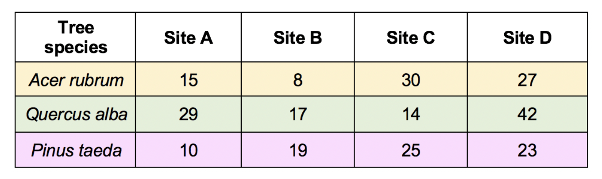
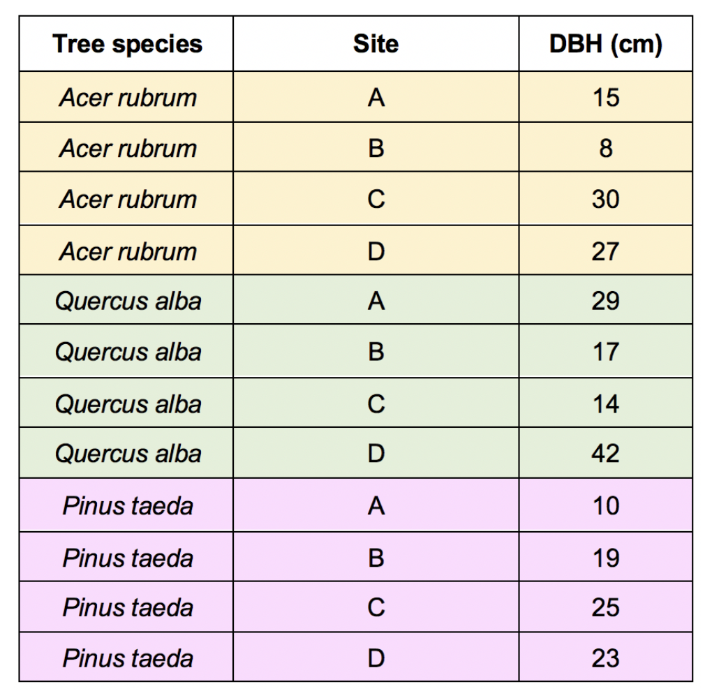

```{r setup, include=FALSE}
knitr::opts_chunk$set(echo = TRUE)
```

# Making Untidy Data Tidy

One major task of working with data (especially other people's data!) is to tidy up the dataset so that we can successfully calculate our descriptive statistics with `group_by` and `summarize`, make our data visualizations with `ggplot2`, and eventually conduct our statistical analyses.

This week's lessons are all about how to make untidy data into tidy data. First, let's remind ourselves what out "tidy" data means.

{width="75%" fig-align="center"}

Unfortunately, a lot of existing data doesn't follow these rules. The way in which datasets are untidy are always unique.

However, to analyze the data, we typically need data to be in a tidy format. We can use a number of functions from the `tidyr` package in the `tidyverse` to help make the data tidy.

## Set-up

### Packages

First, let's load the `tidyverse`.

```{r}

```

### File Paths

Now, let's read in our data. In this lesson, we are going to start incorporating a little bit of information about file paths into our work.

So far, our data files have been in the same place ("working directory" or folder) as our Quarto files. Now, however, we have our data in a data folder.

In order to tell R which data file we want to use (or where to save a data file we want to download), we have to point R to the exact location, which is no longer the same place as where our Quarto file is stored.

To do so, we must tell our to first look in the `data` folder and *then* tell it which file we want to read in.

The data file we are using is called `macroplot_data.txt`. When we open the file and take a look at it, we can see that it is tab-delimited, meaning we will want to use the `read_tsv()` function.

```{r}

```

### Data Structure

Let's take a look. These data are tree girths from the Western Ghats, a mountainous region on the western edge of the Indian peninsula. This area is considered one of the top biodiversity hotspots in the world.

Any time that a tree had more than one stem (trunk), the diameter of each stem got entered into a new column.

Is this good data structure? Why or why not? What do we need to fix?

Before we get started, let's add a `treeid` column to our data frame using the `mutate` function from `dplyr`. We want one `treeid` for each row because there is one tree for each row. We can use the `.before` argument to determine where the new column in located in the data frame.

Because the `Plot ID` column has a space in its name, we can't reference it as we normally would. Instead, we can put backticks around it.

```{r}

```

## Renaming Columns

After a while, putting backticks around column names is going to get tedious. Thankfully, the `tidyverse` has a helpful function for renaming columns.

The argument in `rename()` is the new name of the column equal to the old name.

```{r}

```

That is much better!

## Completing Data with Gaps

When recording data, people might write out a value once and then leave the following rows blank, assuming that all of the following rows are the same value until a new value is present.

This is human-readable but not computer-readable.

We can fill in these gaps using the `fill()` function. The default direction is "down," but other directions are possible.

```{r}

```

## Wide Data vs. Long Data

Data are often structured in a way that doesn't allow us to (easily) perform calculations or plot the data. We, therefore, need to wrangle data between "wide" format and "long format" to get the data in a structure that better serves our purposes.

One format isn't necessary better than the other in terms of "tidy" data, although you would often hear people use tidy data and long format data interchangeably. There are some instances where the "longest" form of the data is not actually considered tidy data.

Here, we are going to focus on converting between the types using two functions from the `tidyr` package (part of the `tidyverse`, of course!): `pivot_longer()` and `pivot_wider()`.

Like with the `join` functions, visualizing how these functions work takes a bit of practice. For GIFs demonstrating them, head over to the trusty [tidyexplain](https://www.garrickadenbuie.com/project/tidyexplain/#tidy-data) site.

**Wide Data**

In this example of wide data, the data table has one row per tree species with columns for each site.

{width="50%" fig-align="center"}

**Long Data**

In this example of long data, the data table has one row per tree species per site, and columns represent unique variables. In this example, the long format is considered tidy data.

{width="50%" fig-align="center"}

One common issue with wide data is that data is spread over multiple columns that should be in one. For example, in the tables above, the "Sites" as column names are violating the rule of not having data in column names. Instead, that data should be in one column, like in the long data.

To get the data in this form, we can use a function from `tidyr` called `pivot_longer`.

## Pivot Longer

The `pivot_longer()` function takes the following arguments (as well as many other optional arguments). This function was previously called `spread()`, which you might still see in other people's code sometimes.

-   the data frame
-   columns to include (or not include)
-   `names_to`: the name of the new column to put the previous column names in
-   `values_to`: the name of the new column to put the values from the cells in

Any redundant or unnecessary columns will be automatically removed.

```{r}

```

As a reminder, the colon specifies all columns starting at `TreeGirth1` and ending at `TreeGirth5`

### Replace Values with `NA`

As you might have noticed, there are still 0s where there were no stems. We probably don't want those zeros to still be there. Instead, we might want them to be `NA` values.

To do so, we can use a function (from `dplyr`) called `na_if`. This function allows us to replace certain values with `NA`. We can use this function within a `mutate` function.

The arguments in `na_if` are the vector (column) you want the values replaced in and the value to be replaced.

```{r}

```

### Drop Rows with `NA` Values

Often, we might want to remove these rows altogether. To remove rows that have `NA` values in a specific column, we could use the `filter` function and `!is.na()`, as we have in the past.

Alternatively, we could use the `drop_na()` function, which does the same thing.

```{r}

```

### Let's Practice!

In the assignment, work on Question 1a and 1b.

### `extract()` Values from a Column

There are a number of ways that we can work with character strings, and we will cover many of those more in depth in another lesson. For now, we will stick to one helpful function called `extract()`.

Let's say we want the `Stem` column to have only the number of the stem (1-5) rather than "TreeGirth1".

`extract()` will extract one or more values from a column. It uses something called "regular expressions." We might get into details about regular expression later, but we won't worry about them too much for now.

The arguments for `extract` are:

-   the data frame
-   the name of the column from which we want to extract something (`col`)
-   the name(s) of the new column(s) (`into`)
-   the "regular expression" specifying what to extract (we will talk more about regular expressions, or "regex", later in the semester; `regex`)

```{r}

```

Here, `TreeGirth.` means the phrase "TreeGirth" followed by a single value. The `()` indicate what part of this string to extract, so just the number at the end of the string.

This gives us the result we want, with just the stem number in the `Stem` column.

You may notice that this number is on the left side of the column, not the right. That's because the number is still stored as a character, because it was extracted from a character string.

To convert it to it's actual type (numeric), we can add the optional argument `convert = TRUE` to `extract`.

```{r}

```

Adding the `convert = TRUE` argument is a helpful addition when extracting numbers so you can then work with the column as numbers.

### `separate()` a Column into Multiple Columns

In the `SpCode` column, the Genus and Species information for each tree are combined in a single column. If we want to group by genera, for example, having these data separated might be useful.

We can do so using the `separate()` function, which takes the following arguments:

We can do so using the `separate()` function, which takes the following arguments:

-   the data frame
-   the name of the column to separate (`col`)
-   new column names (`into`)
-   the separator value, character, or position (if character, it must be in quotation marks, e.g., "-"; `sep`)

```{r}

```

## Pivot Wider

Occasionally, we need to convert data the other way: from long to wide.

For example, this is fairly common for analyses of community-level data. Many packages will want cross-tab (or wide) data, such as a site by species matrix.

Let's demonstrate with an example calculating the number of stems per species. First, we need to group and summarize the data.

```{r}

```

To get the site by species matrix, we need to make the dataset wider. Since the species ID will end up as column names, we need to bring the columns back together.

### Let's Practice!

Work on Question 2 in the assignment.

### `unite` Columns into One

To bring multiple columns together into one column, we use a function that does the opposite of `separate()`: `unite()`.

The `unite()` function takes the following arguments:

-   the data frame
-   the name of the new column to hold the united date (`col`); this should be written in quotation marks
-   the columns to be united 
-   the separator value, character, or position (`sep`)

```{r}

```

### Replacing Values

There is also one species code for unknown species. While in long format we would likely convert this to an `NA` value, because it will become a column name, we probably want to make it something interpretable.

To do this, we can use a combination of the mutate function with the `replace` function. The `replace` function is part of the `base` package that comes build into R.

The `replace` function, when used inside the `mutate` function, the arguments are:

-   the name of the column
-   the condition that, if met, means the value will be replaced
-   the value to use as the replacement

```{r}

```

Now we can go ahead and convert the data into a wider format.

### `pivot_wider()`

Using `pivot_wider()` will spread values from one column into column names. It will then fill in the appropriate values. Like `pivot_longer()`, `pivot_wider()` has an older counterpart that you will likely still see called `gather()`.

`pivot_wider()` has many arguments, but these are the required ones:

-   the data frame
-   the name of column to use for column names
-   the name of column that contains the values to fill in the cells

```{r}

```

Ok, that is a lot of `NA` values...

In this case, it would likely make sense to replace these `NA` values with 0. We can do this in a couple ways. With `pivot_wider()`, there is an optional argument to specify what value to use for any empty cells after the conversion.

```{r}

```

You should now be able to complete the assignment!