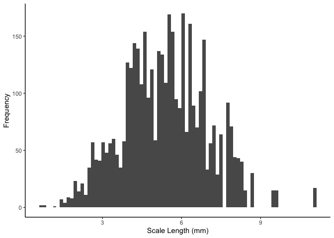

Fish Analysis
================
Ellen Bledsoe
2025-04-01

### 3. Committing Multiple Files (15 points)

    ## # A tibble: 4,029 × 6
    ##    lakeid fish_id annnumber length radii_length_mm scalelength
    ##    <chr>    <dbl> <chr>      <dbl>           <dbl>       <dbl>
    ##  1 AL         299 EDGE         167            2.70        2.70
    ##  2 AL         299 2            167            2.04        2.70
    ##  3 AL         299 1            167            1.31        2.70
    ##  4 AL         300 EDGE         175            3.02        3.02
    ##  5 AL         300 3            175            2.67        3.02
    ##  6 AL         300 2            175            2.14        3.02
    ##  7 AL         300 1            175            1.23        3.02
    ##  8 AL         301 EDGE         194            3.34        3.34
    ##  9 AL         301 3            194            2.97        3.34
    ## 10 AL         301 2            194            2.29        3.34
    ## # ℹ 4,019 more rows

### 4. Pulling and Pushing (20 points)

<!-- -->
