---

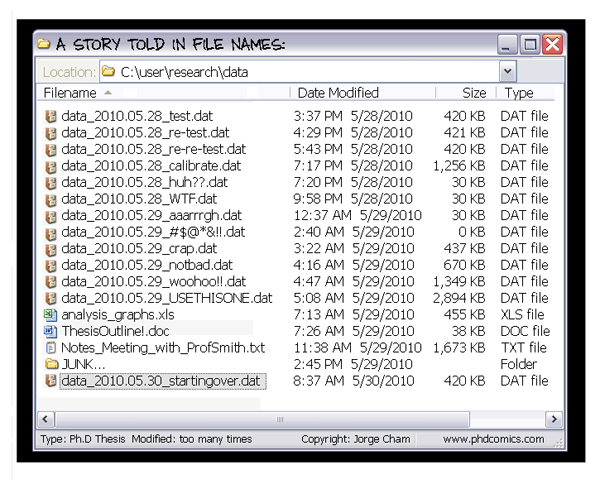

---

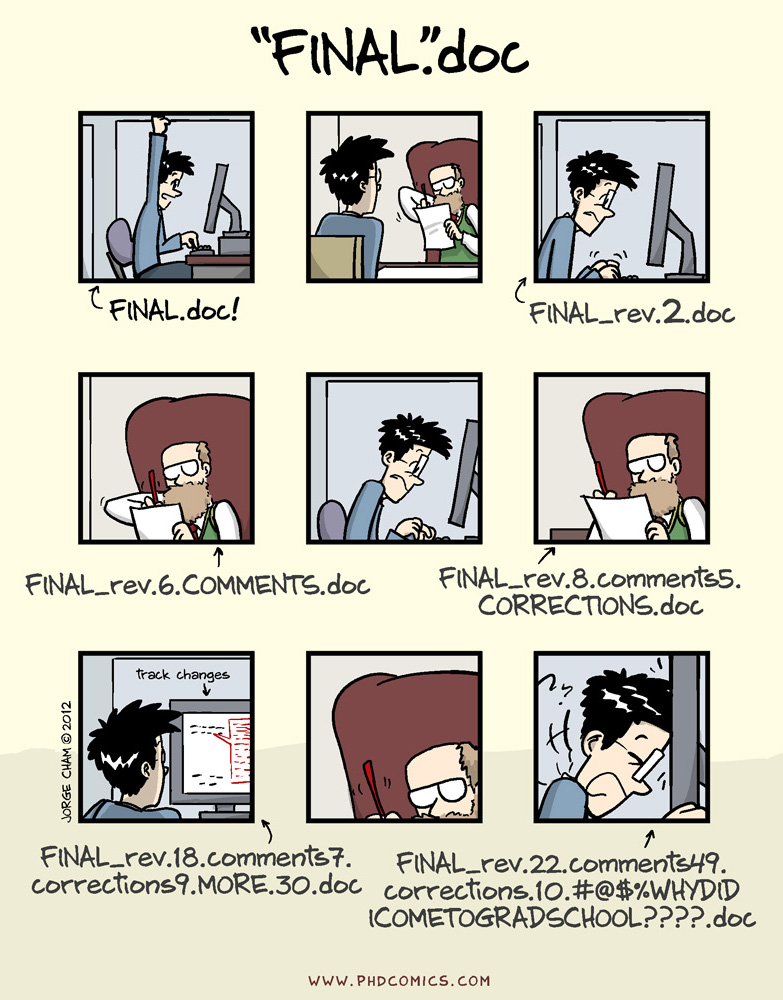

## What is version control?

Version control is a system that records changes to documents, code, data, etc. through time.

It allows us to take **snapshots ("commit")** of our files and to revert back to previous snapshots if desired.

It also allows us to work **collaboratively** on files by keeping track of who did what and finding any conflicts (e.g., if 2 people changed the same line of code).

---

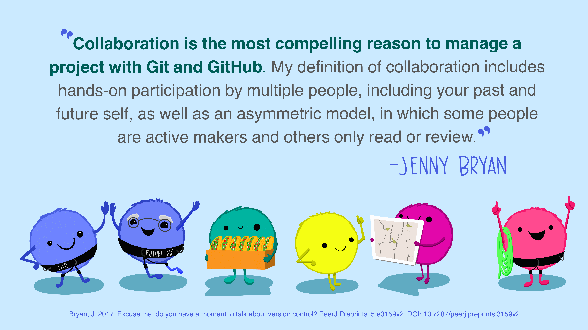

Allison Horst: <https://openscapes.org/blog/2022-05-27-github-illustrated-series/>

---

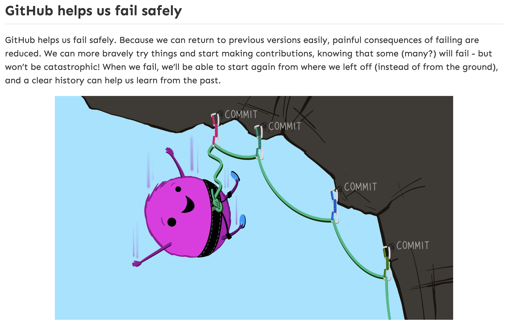

Allison Horst: <https://openscapes.org/blog/2022-05-27-github-illustrated-series/>

## Remote vs. Local

::::: columns
::: {.column width="50%"}
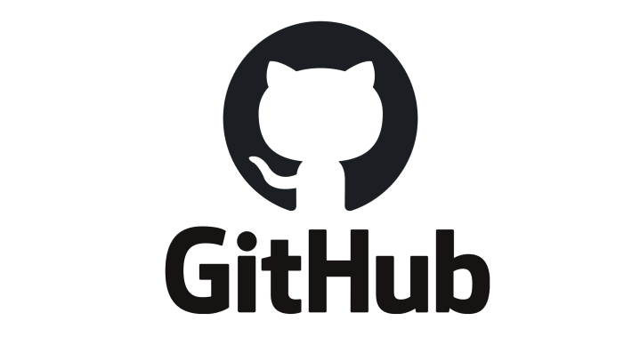
:::
::: {.column width="50%"}
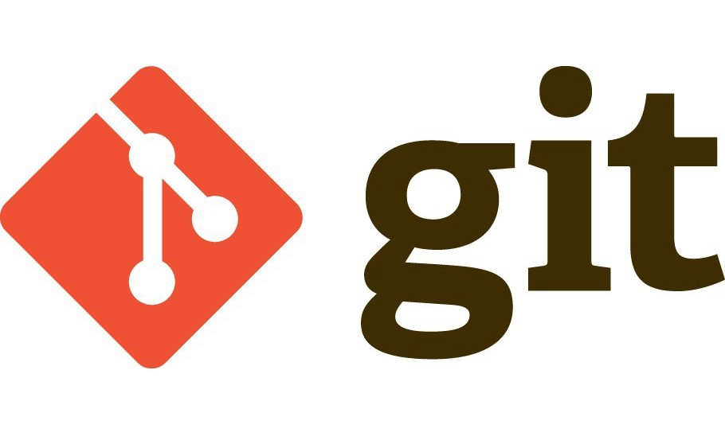
:::
:::::

## The git/GitHub Workflow

::::: columns
::: {.column width="30%"}
**Remote Repo (GitHub)**

push / pull

**Local Repos (git)**

add → commit → push

pull → work → add → commit
:::
::: {.column width="70%"}

:::
:::::

## The git/GitHub Workflow

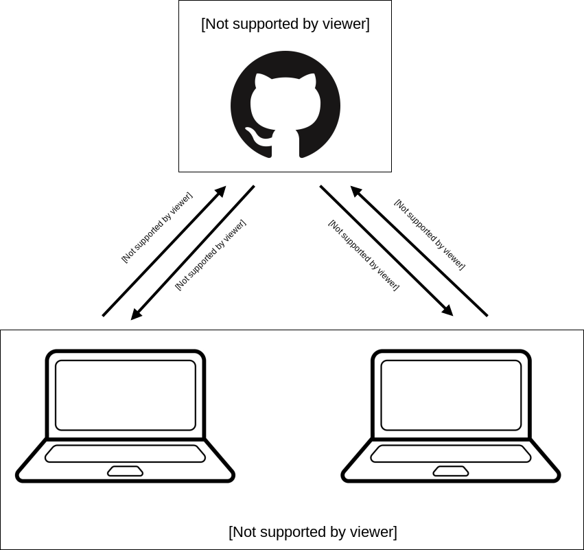

## Introduce Ourselves to git

Tell git who you are (and what your GitHub account is).

## Chapter 7: Introductions

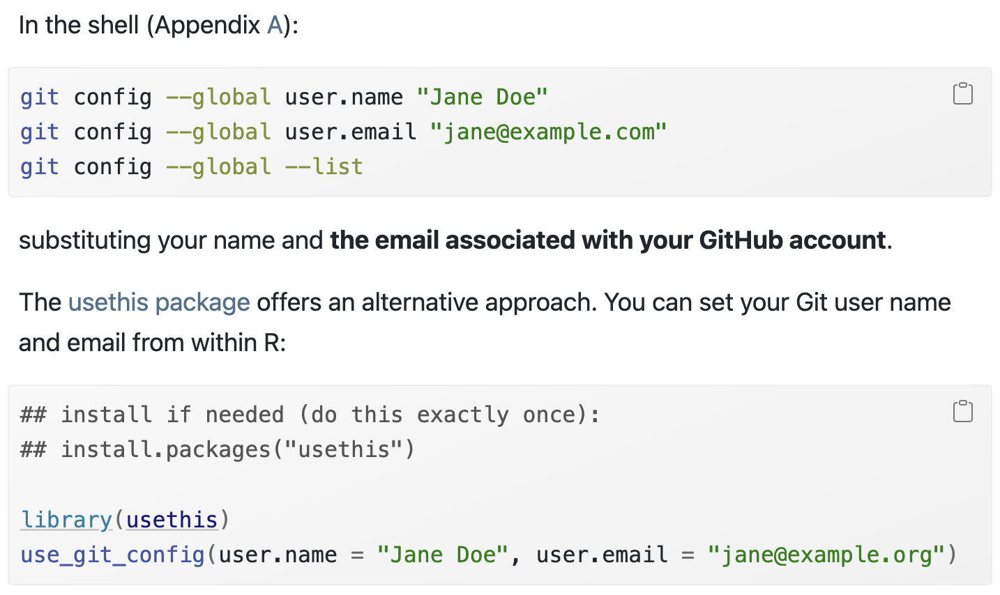

## git/GitHub and RStudio

Version Control through RStudio Projects

## Chapter 9: PAT for HTTPS

::::: columns
::: {.column width="50%"}
**STEP 1** — Select no expiration

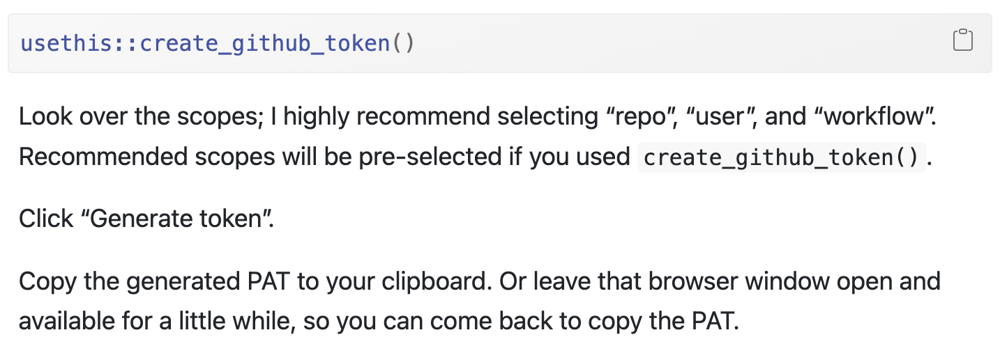
:::
::: {.column width="50%"}
**STEP 2**

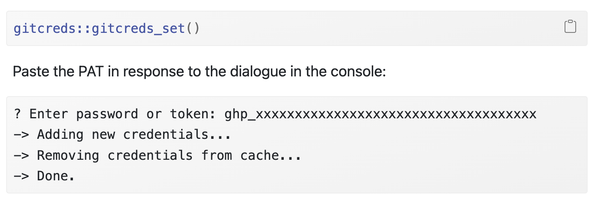
:::
:::::

## Chapter 11: Connect everything!

**STEP 1:** Clone the repository address

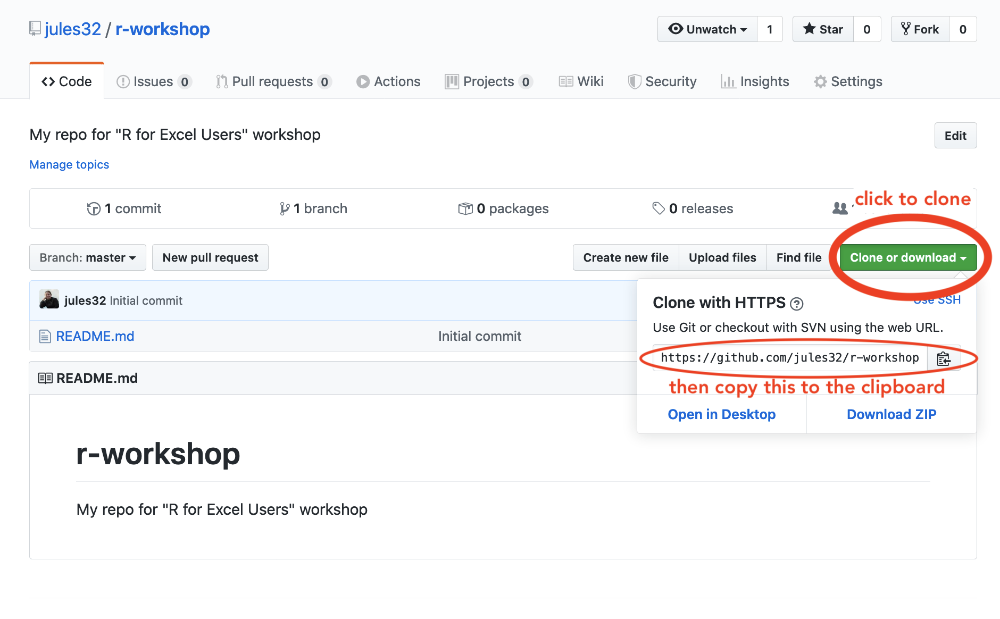

Images from: <https://rstudio-conf-2020.github.io/r-for-excel/github.html#github>

## Chapter 11: Connect everything!

**STEP 2:** Create a new RStudio Project

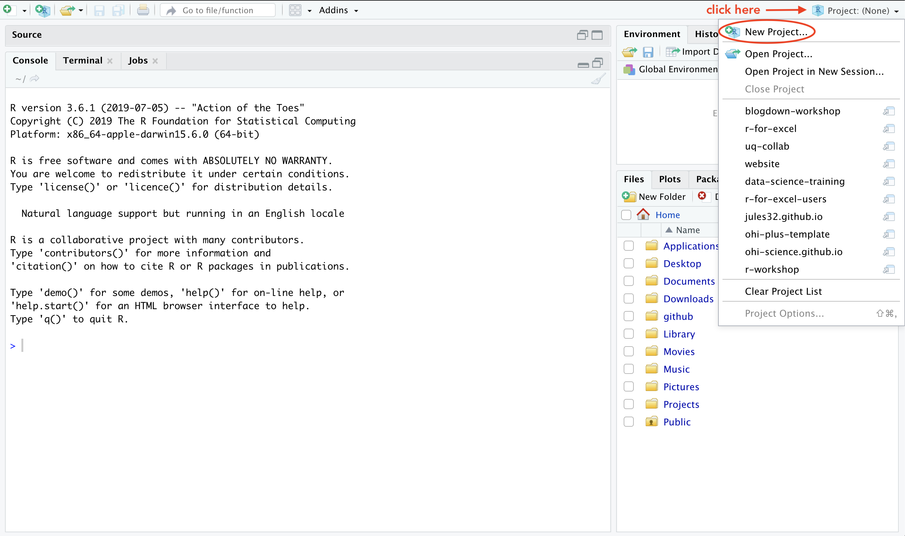

Images from: <https://rstudio-conf-2020.github.io/r-for-excel/github.html#github>

## Chapter 11: Connect everything!

**STEPS 3 and 4:** Select "Version Control", then "Git"

::::: columns
::: {.column width="50%"}
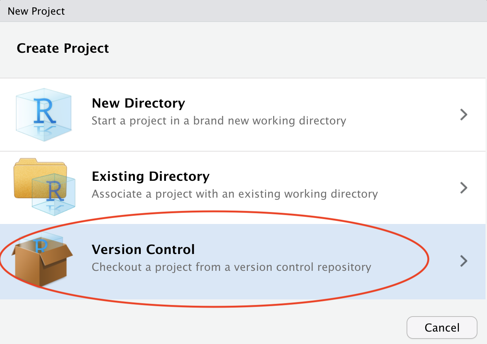
:::
::: {.column width="50%"}
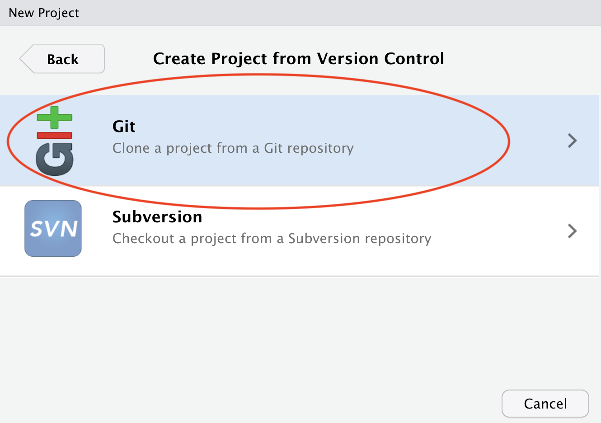
:::
:::::

Images from: <https://rstudio-conf-2020.github.io/r-for-excel/github.html#github>

## Chapter 11: Connect everything!

**STEP 5:** Paste the repo address in "Repository URL"

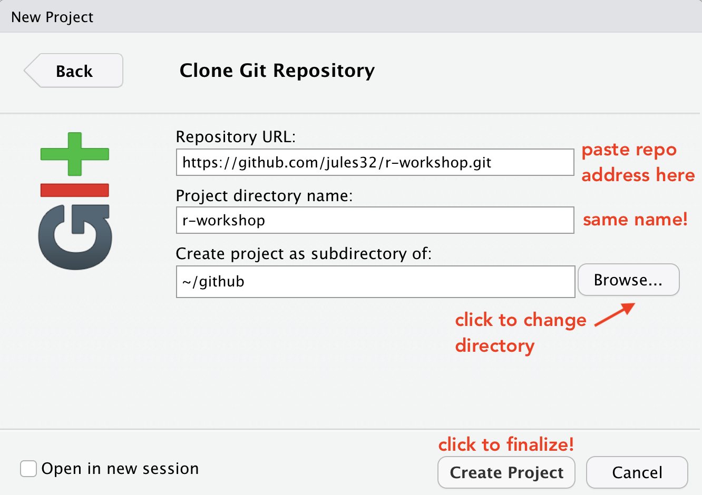

Images from: <https://rstudio-conf-2020.github.io/r-for-excel/github.html#github>

## How to Commit Files

1. **Save** — Save the changes in the file(s) you have been working on
2. **Add** — Open the Commit window by clicking "Commit" in the Git tab; click the empty square next to the file to "stage" it
3. **Commit** — Write a descriptive commit message, then click "Commit"
4. **Pull** — Click the Pull button (blue arrow ↓); fix any merge conflicts that occur
5. **Push** — Click the Push button (green arrow ↑) to send your committed changes to GitHub

---

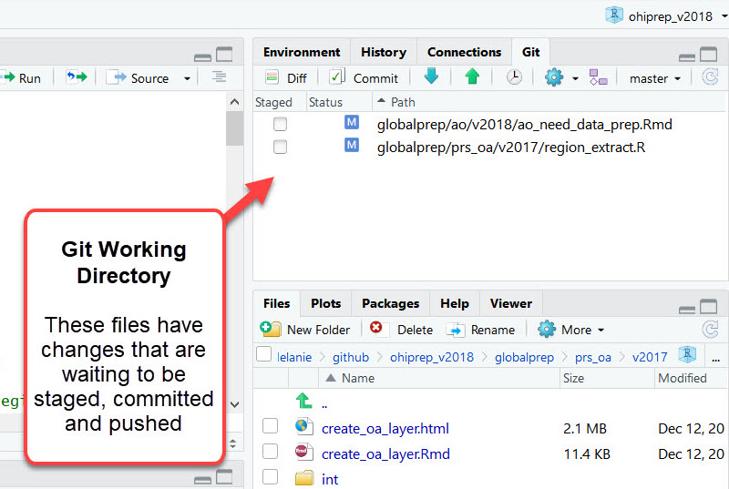

---

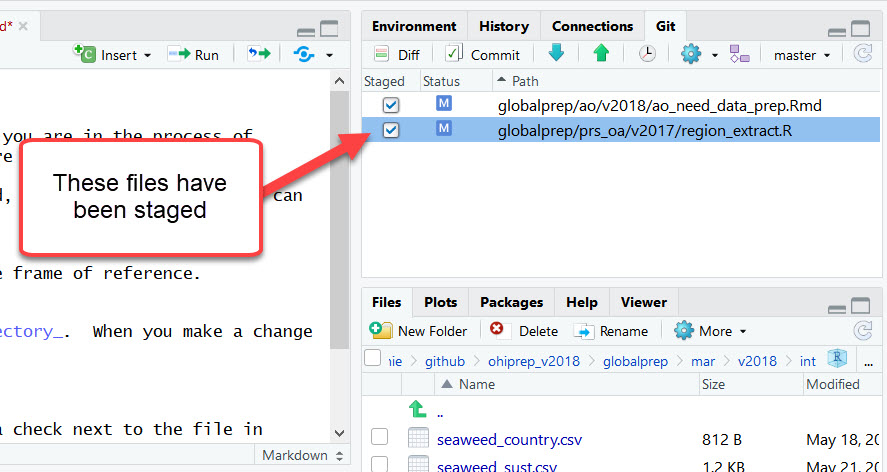

---

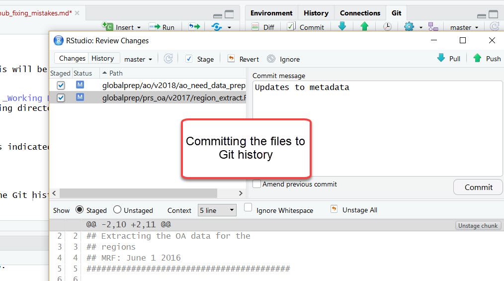

## First, pull any commits from the remote repo

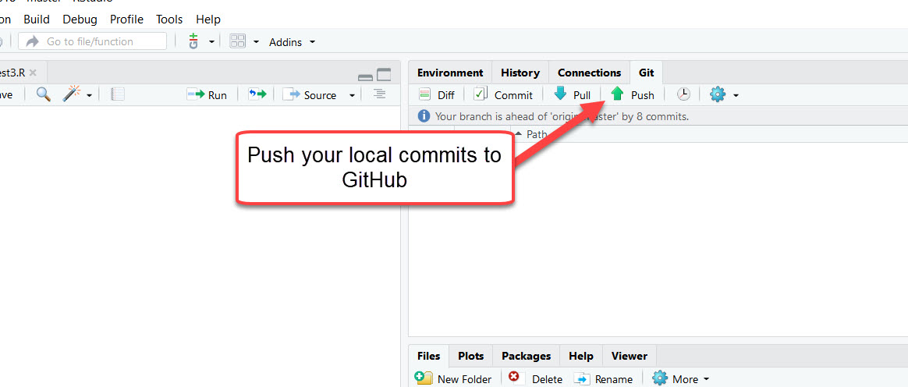

## Helpful Resources

- **Happy Git with R** — the most helpful resource
- **GitHub Docs** — well-documented official documentation
- When in doubt, Google or use ChatGPT!
